```markdown
# Database Design Study Guide (Algonquin College Example) - Enhanced

## 📌 Table of Contents
- [Project Overview](#project-overview)
- [Database Design Roadmap](#database-design-roadmap)
- [Conceptual Design Process](#conceptual-design-process)
- [Complete ER Diagram](#complete-er-diagram)
- [Normalization Process](#normalization-process)
- [SQL Schema Implementation](#sql-schema-implementation)
- [Optimization Techniques](#optimization-techniques)
- [Entity Types](#entity-types)
- [Cardinality & Relationships](#cardinality--relationships)
- [Database Implementation Roadmap](#database-implementation-roadmap)
- [Requirements Gathering Techniques](#requirements-gathering-techniques)
- [Key Terminology](#key-terminology)

---

## 🔍 Project Overview

**Scenario:** Algonquin College Academic Management System  
**Purpose:** Design a database to track students, courses, professors, and enrollments with college-specific rules.

**Key Features:**
- Student enrollment tracking
- Course prerequisites management
- Semester-based grade recording
- Algonquin-specific data validation (email formats, course codes)
- Business Intelligence integration (performance dashboards)

**Business Rules:**
- Students have Algonquin emails (`firstname.lastname@algonquinlive.com`)
- Course codes follow AAA#### pattern (e.g., CST8284)
- Programs require minimum 60 credits for diplomas
- Professors must have `@algonquinlive.com` emails
- Age is derived from birthdate (not stored)

---

## 🗺 Database Design Roadmap

**Phase 1: Conceptual Design**
- Identify Requirements  
    Techniques: Interviews, Surveys, Observations, Historical Data
- Identify Entities  
    - Strong Entities: Independent objects (e.g., Student, Professor)
    - Weak Entities: Dependent objects (e.g., Enrollment)
- Identify Interactions  
    Map relationships between entities (e.g., "Students register for Courses")

**Phase 2: Logical Design**
- Define Attributes  
    - Required vs. Optional
    - Single-valued vs. Multi-valued
    - Stored vs. Derived
- Establish Relationships  
    - Cardinality (1:1, 1:M, M:N)
    - Primary/Foreign Keys
- Normalize to 3NF  
    Eliminate redundancy and dependencies

**Phase 3: Physical Design**
- Implement using DBMS  
    Create tables, columns, keys
- Apply Business Rules  
    Constraints, validation checks
- Optimize Performance  
    Indexing, partitioning

---
```
## 🧠 Conceptual Design Process

**3-Step Workflow:**
1. Identify Entities

| Entity      | Type         | Description                |
|-------------|--------------|----------------------------|
| Student     | Strong Entity| 9-digit student ID         |
| Professor   | Strong Entity| Faculty teaching courses   |
| Course      | Strong Entity| Courses with program mapping|
| Enrollment  | Weak Entity  | Semester registrations     |
| Department  | Strong Entity| Manages academic programs  |

2. Identify Interactions
- "Students register for Courses every semester"
- "Professors teach Courses"
- "Departments offer Programs"

3. Create Conceptual Diagram
- Rectangles = Entities
- Lines = Interactions
- Avoid attributes at this stage

**Key Principles:**
- **Independence:** Strong entities exist alone (e.g., Department without employees)
- **Dependency:** Weak entities require strong entities (e.g., Enrollment needs Student and Course)
- **Multi-valued Attributes:** Resolve with separate tables (e.g., Student_Hobbies table)

---

## 📊 Complete ER Diagram

```mermaid
erDiagram
        STUDENT {
                bigint student_id PK
                varchar(100) name
                varchar(120) email
                date birth_date
        }
        COURSE {
                char(7) course_code PK
                varchar(100) title
                int credits
        }
        DEPARTMENT {
                int dept_id PK
                varchar(50) name
                int chair_professor_id FK
        }
        STUDENT ||--o{ ENROLLMENT : "has"
        COURSE ||--o{ ENROLLMENT : "offers"
        COURSE ||--o{ PREREQUISITE : "requires"
        DEPARTMENT ||--o{ COURSE : "manages"
        PROFESSOR ||--o{ COURSE_ASSIGNMENT : "teaches"
```



---

## 🔄 Normalization Process

**Industry Case Study:**  
A BI dashboard showed incorrect reports due to poor database design. Normalization fixed issues in 1.5 months by:
- Removing multi-valued attributes
- Eliminating transitive dependencies
- Fixing partial key dependencies

**Steps:**
- **1NF (First Normal Form):**  
    Atomic values only (split CSV lists like courses_taken into Enrollments table)
- **2NF (Second Normal Form):**  
    Remove partial dependencies (e.g., move program_name from Students to Programs)
- **3NF (Third Normal Form):**  
    Eliminate transitive dependencies (e.g., extract dean from Programs to Departments)

**Normalized Schema Preview:**
```sql
CREATE TABLE Programs (
        program_id INT PRIMARY KEY,
        name VARCHAR(50) NOT NULL,
        dept_id INT REFERENCES Departments(dept_id)
);
```

---

## 💻 SQL Schema Implementation

**Strong Entity Example (Professor):**
```sql
CREATE TABLE Professors (
        professor_id INT PRIMARY KEY AUTO_INCREMENT,
        name VARCHAR(100) NOT NULL,
        email VARCHAR(120) UNIQUE CHECK (email LIKE '%@algonquinlive.com')
) ENGINE=InnoDB;
```

**Weak Entity Example (Course Assignment):**
```sql
CREATE TABLE Course_Assignments (
        assignment_id INT AUTO_INCREMENT,
        course_code CHAR(7),
        professor_id INT,
        semester CHAR(5) NOT NULL,
        PRIMARY KEY (assignment_id, course_code, professor_id),
        FOREIGN KEY (course_code) REFERENCES Courses(course_code),
        FOREIGN KEY (professor_id) REFERENCES Professors(professor_id)
);
```

**Derived Attribute Handling (Age Calculation):**
```sql
ALTER TABLE Students ADD COLUMN birth_date DATE;

-- Calculate age in queries
SELECT student_id, name,
        TIMESTAMPDIFF(YEAR, birth_date, CURDATE()) AS age
FROM Students;
```

---

## ⚡ Optimization Techniques

**Partitioning by Semester:**
```sql
CREATE TABLE Enrollments (
        enrollment_id INT AUTO_INCREMENT,
        student_id BIGINT,
        course_code CHAR(7),
        semester CHAR(5) NOT NULL CHECK (semester REGEXP '^[FWS][0-9]{4}$'),
        PRIMARY KEY (enrollment_id, student_id, course_code),
        FOREIGN KEY (student_id) REFERENCES Students(student_id) ON DELETE CASCADE,
        FOREIGN KEY (course_code) REFERENCES Courses(course_code)
) PARTITION BY RANGE COLUMNS(semester) (
        PARTITION p2023 VALUES LESS THAN ('W2024'),
        PARTITION p2024 VALUES LESS THAN ('W2025')
);
```

---

## 🏢 Entity Types

**Strong Entities vs. Weak Entities:**

| Characteristic   | Strong Entity         | Weak Entity                        |
|------------------|----------------------|------------------------------------|
| Existence        | Independent          | Depends on strong entity           |
| Primary Key      | Single-column PK     | Composite PK (partial key + FK)    |
| Example          | Professors(professor_id) | Prerequisites(course_code, prereq_code) |
| DB Representation| Rectangles in ERD    | Double-border rectangles in ERD    |

**Weak Entity Implementation:**
```sql
CREATE TABLE Prerequisites (
        course_code CHAR(7),
        prereq_code CHAR(7),
        PRIMARY KEY (course_code, prereq_code),
        FOREIGN KEY (course_code) REFERENCES Courses(course_code)
);
```

---

## ↔️ Cardinality & Relationships

**Determination Method:**
- Draw line between two entities (e.g., Student and Course)
- Ask:
    - "One Student can register for ______ Courses?" → Many (M)
    - "One Course can be taken by ______ Students?" → One (1)
- Relationship = 1:M

**Cardinality Types:**

| Type | Max Cardinality | Min Cardinality              | Example                                   |
|------|-----------------|------------------------------|-------------------------------------------|
| 1:1  | One-to-One      | Mandatory/Optional           | "One department has one chair professor"  |
| 1:M  | One-to-Many     | Parent required for child    | "One professor teaches many courses"      |
| M:N  | Many-to-Many    | Independent existence        | "Students register for courses"           |

**1:1 Relationship Implementation:**
```sql
ALTER TABLE Departments
        ADD COLUMN chair_professor_id INT UNIQUE,
        ADD FOREIGN KEY (chair_professor_id) REFERENCES Professors(professor_id);
```

---

## 🛠️ Database Implementation Roadmap

**Phase 1: Design**
- Identify entities and attributes
- Establish relationships (1:1, 1:M, M:N)
- Normalize to 3NF

**Phase 2: Development**
```sql
CREATE DATABASE algonquin COLLATE utf8mb4_unicode_ci;

CREATE TABLE Departments (
        dept_id INT PRIMARY KEY AUTO_INCREMENT,
        name VARCHAR(50) NOT NULL
) ENGINE=InnoDB;
```

**Phase 3: Management**
```sql
-- Routine maintenance
ANALYZE TABLE Students;
OPTIMIZE TABLE Enrollments;

-- Backup command
mysqldump -u root -p algonquin > algonquin_backup.sql
```

---

## 🔍 Requirements Gathering Techniques

**Methods with MySQL Integration:**

| Technique     | Implementation Example                |
|---------------|--------------------------------------|
| Interviews    | Store responses in JSON format        |
| Surveys       | Import CSV via LOAD DATA INFILE       |
| Observations  | Log with triggers                     |
| Historical Data | Analyze with window functions       |

**Business Rules Table:**
```sql
CREATE TABLE BusinessRules (
        rule_id INT AUTO_INCREMENT PRIMARY KEY,
        source ENUM('Interview','Document','Survey'),
        description TEXT,
        implemented BOOLEAN DEFAULT FALSE,
        created_at TIMESTAMP DEFAULT CURRENT_TIMESTAMP
);
```

---
## 🎓 Key Terminology

| Term              | Definition                                                | MySQL Example                                                     | College Example                      |
|-------------------|-----------------------------------------------------------|-------------------------------------------------------------------|--------------------------------------|
| Conceptual Design | High-level entities and interactions without attributes   | N/A                                                               | Initial ER diagram                   |
| Logical Design    | Adds attributes, keys, and data types                     | CREATE TABLE Students(...)                                        | Full ERD with attributes             |
| Physical Design   | DBMS-specific implementation                              | ENGINE=InnoDB, PARTITION BY RANGE                                 | Optimized schema                     |
| Max Cardinality   | Maximum relationships an entity can have (1 or M)         | Determined via "One Professor teaches ______ Courses"             | Professor-Course (1:M)               |
| Min Cardinality   | Whether relationship is mandatory (1) or optional (0)     | NOT NULL vs. NULL                                                 | Course requires Professor            |
| Strong Entity     | Independent objects that exist on their own               | CREATE TABLE Students (id INT PRIMARY KEY, ...);                  | Students table                       |
| Weak Entity       | Depends on a strong entity for existence                  | CREATE TABLE Enrollment (..., FOREIGN KEY...);                    | Enrollment records                   |
| Composite Key     | Primary key consisting of multiple columns                | PRIMARY KEY (student_id, course_code, semester)                   | Enrollment records                   |
| Surrogate Key     | System-generated meaningless identifier                   | professor_id INT AUTO_INCREMENT                                   | Professor IDs                        |
| Normalization     | Organizing data to minimize redundancy                    | -- 3NF implementation separating Students, Programs, Departments  | Academic structure                   |
| Derived Attribute | Calculated value not stored in DB                         | SELECT TIMESTAMPDIFF(YEAR, birth_date, CURDATE()) AS age          | Student age                          |
```
