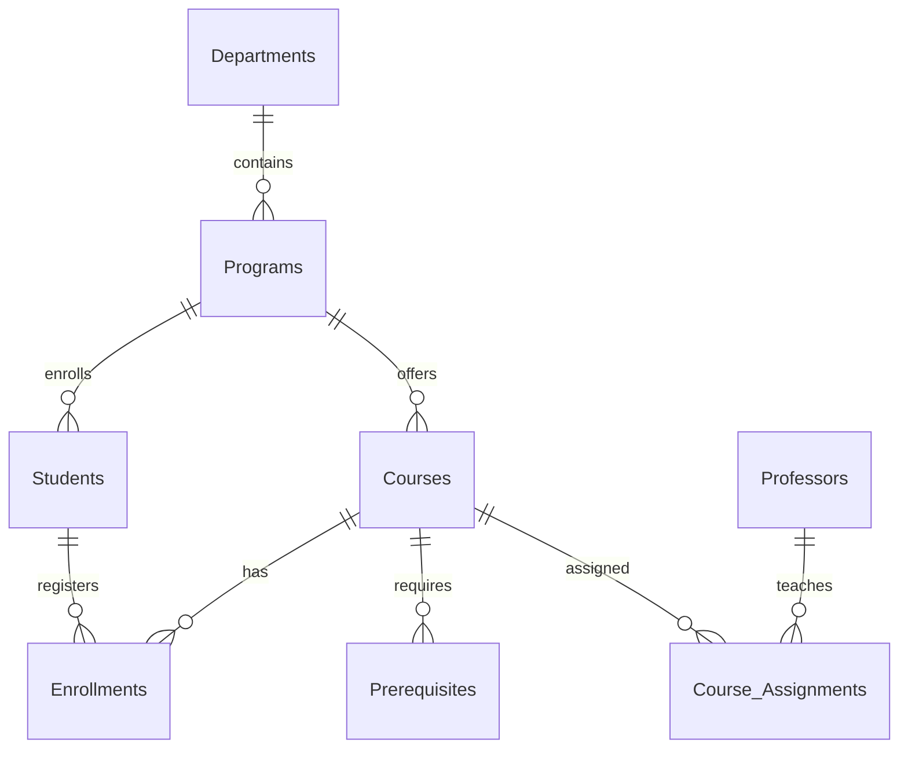

# MySQL Database Tutorial: Algonquin College Academic Management System

## 🚀 Getting Started Guide

This guide is designed for beginners aiming for Bloom's Taxonomy Tier 6 (Create/Evaluate). You'll not only build a normalized database but also understand the *why* behind each step, using MySQL Workbench and MySQL Server Application.

---

## 🖥️ MySQL Server Application & Workbench Navigation

### 1. Install MySQL Server & Workbench

- **Download MySQL Server 8.0+**: [MySQL Server Download](https://dev.mysql.com/downloads/mysql/)
- **Download MySQL Workbench**: [Workbench Download](https://dev.mysql.com/downloads/workbench/)

### 2. Launch MySQL Server Application

- **Windows**: Open "MySQL Installer" or "MySQL Notifier" from Start Menu.
- **macOS/Linux**: Use terminal:  
    ```bash
    sudo systemctl start mysql
    ```

- **Verify Server is Running**:  
    In Workbench, click the connection tile (e.g., "Local instance MySQL80").  
    If you see the SQL editor, you're connected!

### 3. Navigating MySQL Workbench

- **Home Screen**:  
    
- **Create New Connection**:  
    Click `+` next to "MySQL Connections", enter credentials, and save.
- **Open SQL Editor**:  
    Double-click your connection. Use the left sidebar for schemas, tables, and management.

---

## 📊 ER Diagram: Database Design Overview

**Why ER Diagrams?**  
Entity-Relationship diagrams help visualize tables, relationships, and cardinality before coding.



---

## 🔧 Step 1: Database Setup
```mermaid
graph TD
    A[Open MySQL Workbench and connect to your server]
    B[Expand 'algonquin' schema under SCHEMAS]
    C[Right-click 'Tables' and select 'Create Table...']
    D[Enter table name (e.g., Departments)]
    E[Add columns: names, data types, constraints]
    F[Set Primary Key and Auto Increment as needed]
    G[Switch to 'Foreign Keys' tab for relationships]
    H[Click 'Apply' to review and execute SQL]
    I[Repeat for each table]
    J[Tip: Switch between visual and SQL editor]

    A --> B
    B --> C
    C --> D
    D --> E
    E --> F
    F --> G
    G --> H
    H --> I
    I --> J
```


### 1.1 Create Database

**In Workbench:**
- Click the "Create a new schema" icon (cylinder with a star).
- Name it `algonquin`, set collation to `utf8mb4_unicode_ci`, and click "Apply".

**Or run:**
```sql
CREATE DATABASE algonquin COLLATE utf8mb4_unicode_ci;
USE algonquin;
```

### 1.2 Create Admin User

**In Workbench:**
- Go to "Server" > "Users and Privileges".
- Click "Add Account", set username `ac_admin`, password, and assign privileges.

**Or run:**
```sql
CREATE USER 'ac_admin'@'localhost' IDENTIFIED BY 'secure_password_123';
GRANT ALL PRIVILEGES ON algonquin.* TO 'ac_admin'@'localhost';
FLUSH PRIVILEGES;
```

---

## 🏗️ Step 2: Create Strong Entities

**Why?**  
Strong entities are independent tables forming the backbone of your schema.

### 2.1 Departments Table

```sql
CREATE TABLE Departments (
        dept_id INT AUTO_INCREMENT PRIMARY KEY,
        name VARCHAR(50) NOT NULL UNIQUE
) ENGINE=InnoDB;
```

### 2.2 Programs Table

```sql
CREATE TABLE Programs (
        program_id INT AUTO_INCREMENT PRIMARY KEY,
        name VARCHAR(50) NOT NULL UNIQUE,
        min_credits INT DEFAULT 60 CHECK (min_credits >= 60),
        dept_id INT NOT NULL,
        FOREIGN KEY (dept_id) REFERENCES Departments(dept_id)
) ENGINE=InnoDB;
```

### 2.3 Students Table

```sql
CREATE TABLE Students (
        student_id BIGINT PRIMARY KEY 
                CHECK (student_id BETWEEN 100000000 AND 999999999),
        first_name VARCHAR(50) NOT NULL,
        last_name VARCHAR(50) NOT NULL,
        email VARCHAR(120) UNIQUE 
                CHECK (email REGEXP '^[a-z]+\\.[a-z]+@algonquinlive\\.com$'),
        program_id INT NOT NULL,
        birth_date DATE,
        enrollment_date DATE DEFAULT (CURRENT_DATE),
        FOREIGN KEY (program_id) REFERENCES Programs(program_id)
) ENGINE=InnoDB;
```

### 2.4 Professors Table

```sql
CREATE TABLE Professors (
        professor_id INT AUTO_INCREMENT PRIMARY KEY,
        first_name VARCHAR(50) NOT NULL,
        last_name VARCHAR(50) NOT NULL,
        email VARCHAR(120) UNIQUE 
                CHECK (email LIKE '%@algonquinlive.com'),
        department_id INT NOT NULL,
        hire_date DATE,
        FOREIGN KEY (department_id) REFERENCES Departments(dept_id)
) ENGINE=InnoDB;
```

### 2.5 Courses Table

```sql
CREATE TABLE Courses (
        course_code CHAR(7) PRIMARY KEY 
                CHECK (course_code REGEXP '^[A-Z]{3}[0-9]{4}$'),
        title VARCHAR(100) NOT NULL,
        credits INT NOT NULL CHECK (credits BETWEEN 1 AND 6),
        description TEXT
) ENGINE=InnoDB;
```

---

## 🔗 Step 3: Weak Entities & Relationships

**Why?**  
Weak entities depend on strong entities for their existence (e.g., Enrollments need Students and Courses).

### 3.1 Enrollments Table

```sql
CREATE TABLE Enrollments (
        enrollment_id INT AUTO_INCREMENT PRIMARY KEY,
        student_id BIGINT NOT NULL,
        course_code CHAR(7) NOT NULL,
        semester CHAR(5) NOT NULL CHECK (semester REGEXP '^[FWS][0-9]{4}$'),
        grade CHAR(2) CHECK (grade IN ('A+', 'A', 'B+', 'B', 'C+', 'C', 'D+', 'D', 'F', 'W')),
        FOREIGN KEY (student_id) REFERENCES Students(student_id) ON DELETE CASCADE,
        FOREIGN KEY (course_code) REFERENCES Courses(course_code)
) ENGINE=InnoDB;
```

### 3.2 Prerequisites Table

```sql
CREATE TABLE Prerequisites (
        course_code CHAR(7) NOT NULL,
        prereq_code CHAR(7) NOT NULL,
        PRIMARY KEY (course_code, prereq_code),
        FOREIGN KEY (course_code) REFERENCES Courses(course_code),
        FOREIGN KEY (prereq_code) REFERENCES Courses(course_code)
) ENGINE=InnoDB;
```

### 3.3 Course Assignments Table

```sql
CREATE TABLE Course_Assignments (
        assignment_id INT AUTO_INCREMENT PRIMARY KEY,
        course_code CHAR(7) NOT NULL,
        professor_id INT NOT NULL,
        semester CHAR(5) NOT NULL,
        FOREIGN KEY (course_code) REFERENCES Courses(course_code),
        FOREIGN KEY (professor_id) REFERENCES Professors(professor_id)
) ENGINE=InnoDB;
```

---

## ⚙️ Step 4: Optimizations & Security

### 4.1 Indexes

```sql
CREATE INDEX idx_student_name ON Students(last_name, first_name);
CREATE INDEX idx_course_title ON Courses(title);
CREATE INDEX idx_enrollment_semester ON Enrollments(semester);
CREATE INDEX idx_enrollment_grade ON Enrollments(grade);
```

### 4.2 User Roles & Permissions

```sql
CREATE ROLE 'professor';
GRANT SELECT, UPDATE(grade) ON algonquin.Enrollments TO 'professor';

CREATE ROLE 'student';
GRANT SELECT ON algonquin.Courses TO 'student';
GRANT SELECT ON algonquin.Enrollments TO 'student';

CREATE USER 'dr_smith'@'localhost' IDENTIFIED BY 'prof_password';
GRANT 'professor' TO 'dr_smith'@'localhost';
```

### 4.3 Stored Procedures

```sql
DELIMITER //

CREATE PROCEDURE RegisterStudent(
        IN student_id BIGINT,
        IN course_code CHAR(7),
        IN semester CHAR(5)
)
BEGIN
        INSERT INTO Enrollments (student_id, course_code, semester)
        VALUES (student_id, course_code, semester);
END //

CREATE FUNCTION CalculateGPA(student BIGINT) 
RETURNS DECIMAL(3,2)
DETERMINISTIC
BEGIN
        DECLARE total_points DECIMAL(10,2) DEFAULT 0;
        DECLARE total_credits INT DEFAULT 0;
        
        SELECT SUM(
                CASE grade
                        WHEN 'A+' THEN 4.5 * credits
                        WHEN 'A'  THEN 4.0 * credits
                        WHEN 'B+' THEN 3.5 * credits
                        WHEN 'B'  THEN 3.0 * credits
                        WHEN 'C+' THEN 2.5 * credits
                        WHEN 'C'  THEN 2.0 * credits
                        WHEN 'D+' THEN 1.5 * credits
                        WHEN 'D'  THEN 1.0 * credits
                        ELSE 0
                END
        ), SUM(credits)
        INTO total_points, total_credits
        FROM Enrollments e
        JOIN Courses c ON e.course_code = c.course_code
        WHERE e.student_id = student AND grade NOT IN ('W', 'F');
        
        RETURN total_points / NULLIF(total_credits, 0);
END //

DELIMITER ;
```

---

## 📊 Step 5: Insert Sample Data

### 5.1 Add Departments

```sql
INSERT INTO Departments (name) VALUES 
('School of Advanced Technology'),
('School of Business'),
('School of Health Sciences');
```

### 5.2 Add Programs

```sql
INSERT INTO Programs (name, min_credits, dept_id) VALUES
('Computer Programming', 60, 1),
('Business Administration', 60, 2),
('Nursing', 75, 3);
```

### 5.3 Add Courses

```sql
INSERT INTO Courses (course_code, title, credits) VALUES
('CST8284', 'Database Systems', 3),
('CST8285', 'Web Programming', 3),
('BUS2301', 'Business Communications', 4),
('NUR1010', 'Anatomy Fundamentals', 6);
```

### 5.4 Add Students

```sql
INSERT INTO Students (student_id, first_name, last_name, email, program_id) VALUES
(100123456, 'John', 'Doe', 'john.doe@algonquinlive.com', 1),
(100654321, 'Jane', 'Smith', 'jane.smith@algonquinlive.com', 3);
```

---

## 🔍 Step 6: Example Queries

### 6.1 Student Course Load

```sql
SELECT s.first_name, s.last_name, 
             COUNT(e.course_code) AS num_courses,
             SUM(c.credits) AS total_credits
FROM Students s
JOIN Enrollments e ON s.student_id = e.student_id
JOIN Courses c ON e.course_code = c.course_code
WHERE e.semester = 'W2024'
GROUP BY s.student_id;
```

### 6.2 Prerequisite Check

```sql
SELECT s.student_id, s.first_name, s.last_name, c.title AS course
FROM Students s
JOIN Enrollments e ON s.student_id = e.student_id
JOIN Courses c ON e.course_code = c.course_code
WHERE EXISTS (
        SELECT 1 
        FROM Prerequisites p
        WHERE p.course_code = c.course_code
            AND p.prereq_code NOT IN (
                SELECT course_code 
                FROM Enrollments 
                WHERE student_id = s.student_id AND grade NOT IN ('F', 'W')
            )
);
```

### 6.3 Professor Workload

```sql
SELECT p.first_name, p.last_name, 
             COUNT(ca.course_code) AS courses_teaching
FROM Professors p
JOIN Course_Assignments ca ON p.professor_id = ca.professor_id
WHERE ca.semester = 'W2024'
GROUP BY p.professor_id;
```

---

## 🛠️ Maintenance & Backup

### Backup Database

```bash
mysqldump -u ac_admin -p algonquin > algonquin_backup_$(date +%F).sql
```

### Optimize Tables

```sql
OPTIMIZE TABLE Students, Enrollments, Courses;
```

---

## 🌟 Why This Sequence Matters (Bloom's Tier 6)

- **Analyze**: ER diagrams and normalization prevent redundancy and ensure data integrity.
- **Evaluate**: User roles and permissions enforce security best practices.
- **Create**: Stored procedures and functions automate business logic.
- **Apply**: Sample queries demonstrate real-world data retrieval and reporting.
- **Understand**: Visual navigation in Workbench builds confidence in managing databases.
- **Remember**: Regular backups and optimizations ensure data safety and performance.

---

## 📚 Conclusion

You have:
- Designed a normalized, secure, and scalable database
- Used MySQL Workbench and Server Application for hands-on learning
- Visualized relationships with ER diagrams
- Practiced advanced SQL and automation

**Next Steps:**
- Experiment with more complex queries
- Try reverse engineering ER diagrams in Workbench (`Database > Reverse Engineer`)
- Build a simple frontend to interact with your database

