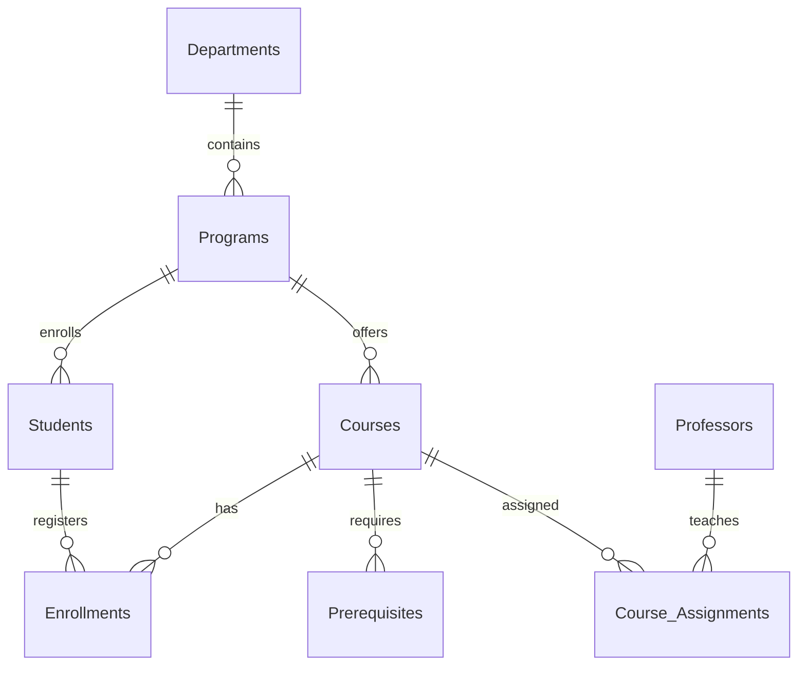
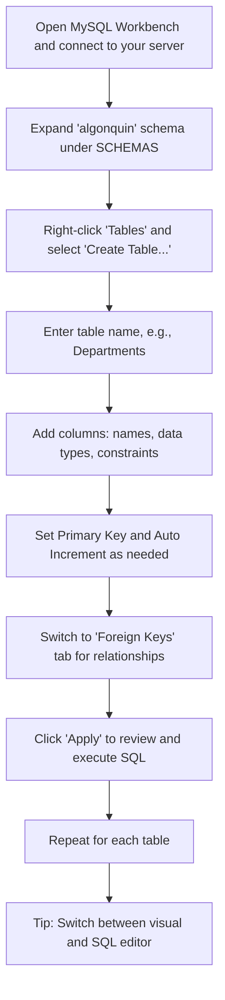
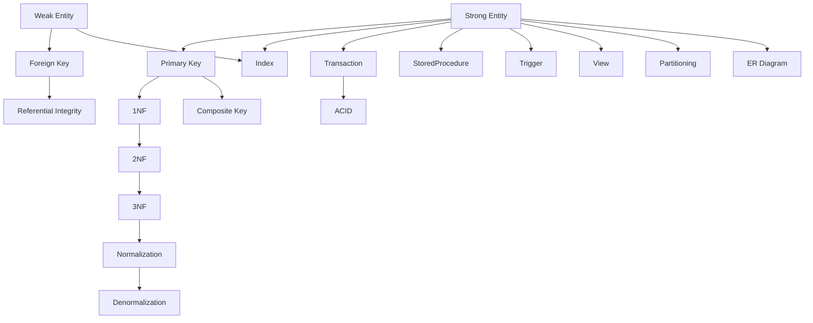

# MySQL Database Tutorial: Algonquin College Academic Management System

## 🚀 Getting Started Guide

This guide is designed for beginners aiming for Bloom's Taxonomy Tier 6 (Create/Evaluate). You'll not only build a normalized database but also understand the *why* behind each step, using MySQL Workbench and MySQL Server Application.

---

## 🖥️ MySQL Server Application & Workbench Navigation

### 1. Install MySQL Server & Workbench

- **Download MySQL Server 8.0+**: [MySQL Server Download](https://dev.mysql.com/downloads/mysql/)
- **Download MySQL Workbench**: [Workbench Download](https://dev.mysql.com/downloads/workbench/)

### 2. Launch MySQL Server Application

- **Windows**: Open "MySQL Installer" or "MySQL Notifier" from Start Menu.
- **macOS/Linux**: Use terminal:  
    ```bash
    sudo systemctl start mysql
    ```

- **Verify Server is Running**:  
    In Workbench, click the connection tile (e.g., "Local instance MySQL80").  
    If you see the SQL editor, you're connected!

### 3. Navigating MySQL Workbench

- **Home Screen**:  
    
- **Create New Connection**:  
    Click `+` next to "MySQL Connections", enter credentials, and save.
- **Open SQL Editor**:  
    Double-click your connection. Use the left sidebar for schemas, tables, and management.

---

## 📊 ER Diagram: Database Design Overview

**Why ER Diagrams?**  
Entity-Relationship diagrams help visualize tables, relationships, and cardinality before coding.



---

## 🔧 Step 1: Database Setup



### 1.1 Create Database

**In Workbench:**
- Click the "Create a new schema" icon (cylinder with a star).
- Name it `algonquin`, set collation to `utf8mb4_unicode_ci`, and click "Apply".

**Or run:**
```sql
CREATE DATABASE algonquin COLLATE utf8mb4_unicode_ci;
USE algonquin;
```

### 1.2 Create Admin User

**In Workbench:**
- Go to "Server" > "Users and Privileges".
- Click "Add Account", set username `ac_admin`, password, and assign privileges.

**Or run:**
```sql
CREATE USER 'ac_admin'@'localhost' IDENTIFIED BY 'secure_password_123';
GRANT ALL PRIVILEGES ON algonquin.* TO 'ac_admin'@'localhost';
FLUSH PRIVILEGES;
```

---

## 🏗️ Step 2: Create Strong Entities

**Why?**  
Strong entities are independent tables forming the backbone of your schema.

### 2.1 Departments Table

```sql
CREATE TABLE Departments (
        dept_id INT AUTO_INCREMENT PRIMARY KEY,
        name VARCHAR(50) NOT NULL UNIQUE
) ENGINE=InnoDB;
```

### 2.2 Programs Table

```sql
CREATE TABLE Programs (
        program_id INT AUTO_INCREMENT PRIMARY KEY,
        name VARCHAR(50) NOT NULL UNIQUE,
        min_credits INT DEFAULT 60 CHECK (min_credits >= 60),
        dept_id INT NOT NULL,
        FOREIGN KEY (dept_id) REFERENCES Departments(dept_id)
) ENGINE=InnoDB;
```

### 2.3 Students Table

```sql
CREATE TABLE Students (
        student_id BIGINT PRIMARY KEY 
                CHECK (student_id BETWEEN 100000000 AND 999999999),
        first_name VARCHAR(50) NOT NULL,
        last_name VARCHAR(50) NOT NULL,
        email VARCHAR(120) UNIQUE 
                CHECK (email REGEXP '^[a-z]+\\.[a-z]+@algonquinlive\\.com$'),
        program_id INT NOT NULL,
        birth_date DATE,
        enrollment_date DATE DEFAULT (CURRENT_DATE),
        FOREIGN KEY (program_id) REFERENCES Programs(program_id)
) ENGINE=InnoDB;
```

### 2.4 Professors Table

```sql
CREATE TABLE Professors (
        professor_id INT AUTO_INCREMENT PRIMARY KEY,
        first_name VARCHAR(50) NOT NULL,
        last_name VARCHAR(50) NOT NULL,
        email VARCHAR(120) UNIQUE 
                CHECK (email LIKE '%@algonquinlive.com'),
        department_id INT NOT NULL,
        hire_date DATE,
        FOREIGN KEY (department_id) REFERENCES Departments(dept_id)
) ENGINE=InnoDB;
```

### 2.5 Courses Table

```sql
CREATE TABLE Courses (
        course_code CHAR(7) PRIMARY KEY 
                CHECK (course_code REGEXP '^[A-Z]{3}[0-9]{4}$'),
        title VARCHAR(100) NOT NULL,
        credits INT NOT NULL CHECK (credits BETWEEN 1 AND 6),
        description TEXT
) ENGINE=InnoDB;
```

---

## 🔗 Step 3: Weak Entities & Relationships

**Why?**  
Weak entities depend on strong entities for their existence (e.g., Enrollments need Students and Courses).

### 3.1 Enrollments Table

```sql
CREATE TABLE Enrollments (
        enrollment_id INT AUTO_INCREMENT PRIMARY KEY,
        student_id BIGINT NOT NULL,
        course_code CHAR(7) NOT NULL,
        semester CHAR(5) NOT NULL CHECK (semester REGEXP '^[FWS][0-9]{4}$'),
        grade CHAR(2) CHECK (grade IN ('A+', 'A', 'B+', 'B', 'C+', 'C', 'D+', 'D', 'F', 'W')),
        FOREIGN KEY (student_id) REFERENCES Students(student_id) ON DELETE CASCADE,
        FOREIGN KEY (course_code) REFERENCES Courses(course_code)
) ENGINE=InnoDB;
```

### 3.2 Prerequisites Table

```sql
CREATE TABLE Prerequisites (
        course_code CHAR(7) NOT NULL,
        prereq_code CHAR(7) NOT NULL,
        PRIMARY KEY (course_code, prereq_code),
        FOREIGN KEY (course_code) REFERENCES Courses(course_code),
        FOREIGN KEY (prereq_code) REFERENCES Courses(course_code)
) ENGINE=InnoDB;
```

### 3.3 Course Assignments Table

```sql
CREATE TABLE Course_Assignments (
        assignment_id INT AUTO_INCREMENT PRIMARY KEY,
        course_code CHAR(7) NOT NULL,
        professor_id INT NOT NULL,
        semester CHAR(5) NOT NULL,
        FOREIGN KEY (course_code) REFERENCES Courses(course_code),
        FOREIGN KEY (professor_id) REFERENCES Professors(professor_id)
) ENGINE=InnoDB;
```

---

## ⚙️ Step 4: Optimizations & Security

### 4.1 Indexes

```sql
CREATE INDEX idx_student_name ON Students(last_name, first_name);
CREATE INDEX idx_course_title ON Courses(title);
CREATE INDEX idx_enrollment_semester ON Enrollments(semester);
CREATE INDEX idx_enrollment_grade ON Enrollments(grade);
```

### 4.2 User Roles & Permissions

```sql
CREATE ROLE 'professor';
GRANT SELECT, UPDATE(grade) ON algonquin.Enrollments TO 'professor';

CREATE ROLE 'student';
GRANT SELECT ON algonquin.Courses TO 'student';
GRANT SELECT ON algonquin.Enrollments TO 'student';

CREATE USER 'dr_smith'@'localhost' IDENTIFIED BY 'prof_password';
GRANT 'professor' TO 'dr_smith'@'localhost';
```

### 4.3 Stored Procedures

```sql
DELIMITER //

CREATE PROCEDURE RegisterStudent(
        IN student_id BIGINT,
        IN course_code CHAR(7),
        IN semester CHAR(5)
)
BEGIN
        INSERT INTO Enrollments (student_id, course_code, semester)
        VALUES (student_id, course_code, semester);
END //

CREATE FUNCTION CalculateGPA(student BIGINT) 
RETURNS DECIMAL(3,2)
DETERMINISTIC
BEGIN
        DECLARE total_points DECIMAL(10,2) DEFAULT 0;
        DECLARE total_credits INT DEFAULT 0;
        
        SELECT SUM(
                CASE grade
                        WHEN 'A+' THEN 4.5 * credits
                        WHEN 'A'  THEN 4.0 * credits
                        WHEN 'B+' THEN 3.5 * credits
                        WHEN 'B'  THEN 3.0 * credits
                        WHEN 'C+' THEN 2.5 * credits
                        WHEN 'C'  THEN 2.0 * credits
                        WHEN 'D+' THEN 1.5 * credits
                        WHEN 'D'  THEN 1.0 * credits
                        ELSE 0
                END
        ), SUM(credits)
        INTO total_points, total_credits
        FROM Enrollments e
        JOIN Courses c ON e.course_code = c.course_code
        WHERE e.student_id = student AND grade NOT IN ('W', 'F');
        
        RETURN total_points / NULLIF(total_credits, 0);
END //

DELIMITER ;
```

---

## 📊 Step 5: Insert Sample Data

### 5.1 Add Departments

```sql
INSERT INTO Departments (name) VALUES 
('School of Advanced Technology'),
('School of Business'),
('School of Health Sciences');
```

### 5.2 Add Programs

```sql
INSERT INTO Programs (name, min_credits, dept_id) VALUES
('Computer Programming', 60, 1),
('Business Administration', 60, 2),
('Nursing', 75, 3);
```

### 5.3 Add Courses

```sql
INSERT INTO Courses (course_code, title, credits) VALUES
('CST8284', 'Database Systems', 3),
('CST8285', 'Web Programming', 3),
('BUS2301', 'Business Communications', 4),
('NUR1010', 'Anatomy Fundamentals', 6);
```

### 5.4 Add Students

```sql
INSERT INTO Students (student_id, first_name, last_name, email, program_id) VALUES
(100123456, 'John', 'Doe', 'john.doe@algonquinlive.com', 1),
(100654321, 'Jane', 'Smith', 'jane.smith@algonquinlive.com', 3);
```

---

## 🔍 Step 6: Example Queries

### 6.1 Student Course Load

```sql
SELECT s.first_name, s.last_name, 
             COUNT(e.course_code) AS num_courses,
             SUM(c.credits) AS total_credits
FROM Students s
JOIN Enrollments e ON s.student_id = e.student_id
JOIN Courses c ON e.course_code = c.course_code
WHERE e.semester = 'W2024'
GROUP BY s.student_id;
```

### 6.2 Prerequisite Check

```sql
SELECT s.student_id, s.first_name, s.last_name, c.title AS course
FROM Students s
JOIN Enrollments e ON s.student_id = e.student_id
JOIN Courses c ON e.course_code = c.course_code
WHERE EXISTS (
        SELECT 1 
        FROM Prerequisites p
        WHERE p.course_code = c.course_code
            AND p.prereq_code NOT IN (
                SELECT course_code 
                FROM Enrollments 
                WHERE student_id = s.student_id AND grade NOT IN ('F', 'W')
            )
);
```

### 6.3 Professor Workload

```sql
SELECT p.first_name, p.last_name, 
             COUNT(ca.course_code) AS courses_teaching
FROM Professors p
JOIN Course_Assignments ca ON p.professor_id = ca.professor_id
WHERE ca.semester = 'W2024'
GROUP BY p.professor_id;
```

---

## 🛠️ Maintenance & Backup

### Backup Database

```bash
mysqldump -u ac_admin -p algonquin > algonquin_backup_$(date +%F).sql
```

### Optimize Tables

```sql
OPTIMIZE TABLE Students, Enrollments, Courses;
```

---

## 🌟 Why This Sequence Matters (Bloom's Tier 6)

- **Analyze**: ER diagrams and normalization prevent redundancy and ensure data integrity.
- **Evaluate**: User roles and permissions enforce security best practices.
- **Create**: Stored procedures and functions automate business logic.
- **Apply**: Sample queries demonstrate real-world data retrieval and reporting.
- **Understand**: Visual navigation in Workbench builds confidence in managing databases.
- **Remember**: Regular backups and optimizations ensure data safety and performance.

---

## 📚 Conclusion

You have:
- Designed a normalized, secure, and scalable database
- Used MySQL Workbench and Server Application for hands-on learning
- Visualized relationships with ER diagrams
- Practiced advanced SQL and automation

**Next Steps:**
- Experiment with more complex queries
- Try reverse engineering ER diagrams in Workbench (`Database > Reverse Engineer`)
- Build a simple frontend to interact with your database

Below is a comprehensive guide mapping essential MySQL concepts to their definitions, commands, and project-based examples. The graph visually connects each concept to its MySQL implementation.

---

### 🗂️ Table: MySQL Concepts, Definitions, and Examples

| **Command/Concept**      | **Definition**                                                                 | **MySQL Example**                                                                                       | **Project Example**                                                                                   |
|--------------------------|-------------------------------------------------------------------------------|---------------------------------------------------------------------------------------------------------|-------------------------------------------------------------------------------------------------------|
| **Strong Entity**        | Table with its own primary key, independent existence                         | `CREATE TABLE Departments (...);`                                                                       | `CREATE TABLE Students (...);`                                                                        |
| **Weak Entity**          | Table dependent on another table (uses FK)                                    | `CREATE TABLE Enrollments (..., FOREIGN KEY (student_id) REFERENCES Students(student_id));`             | `CREATE TABLE Prerequisites (...);`                                                                   |
| **Primary Key (PK)**     | Uniquely identifies each row in a table                                       | `PRIMARY KEY (dept_id)`                                                                                 | `PRIMARY KEY (student_id)`                                                                            |
| **Foreign Key (FK)**     | Enforces link between tables                                                  | `FOREIGN KEY (dept_id) REFERENCES Departments(dept_id)`                                                 | `FOREIGN KEY (program_id) REFERENCES Programs(program_id)`                                            |
| **1NF**                  | Atomic columns, no repeating groups                                           | `CREATE TABLE Courses (title VARCHAR(100));`                                                            | Each course has one title, not a list                                                                 |
| **2NF**                  | 1NF + no partial dependency on PK                                             | Split tables to remove partial dependencies                                                             | Separate `Programs` and `Departments` tables                                                          |
| **3NF**                  | 2NF + no transitive dependency                                                | Remove columns dependent on non-PK attributes                                                           | Move department name to `Departments` table                                                           |
| **Index**                | Improves query speed                                                          | `CREATE INDEX idx_name ON Students(last_name);`                                                         | `CREATE INDEX idx_enrollment_grade ON Enrollments(grade);`                                            |
| **Transaction**          | Group of SQL statements executed as a unit                                    | `START TRANSACTION; ... COMMIT;`                                                                        | Enroll student and update seat count together                                                         |
| **ACID Properties**      | Atomicity, Consistency, Isolation, Durability                                 | Use transactions and InnoDB engine                                                                      | All enrollment steps succeed or fail together                                                         |
| **Stored Procedure**     | Saved SQL logic for reuse                                                     | `CREATE PROCEDURE RegisterStudent(...) BEGIN ... END;`                                                  | `CALL RegisterStudent(100123456, 'CST8284', 'W2024');`                                                |
| **Trigger**              | Auto-executes on table events                                                 | `CREATE TRIGGER before_insert ...`                                                                      | Update seat count after enrollment                                                                    |
| **View**                 | Virtual table based on query                                                  | `CREATE VIEW StudentCourses AS SELECT ...`                                                              | `CREATE VIEW ProgramSummary AS SELECT ...`                                                            |
| **Partitioning**         | Splits table data for performance                                             | `CREATE TABLE Enrollments (...) PARTITION BY RANGE (semester);`                                         | Partition enrollments by semester                                                                     |
| **Normalization**        | Process to reduce redundancy, improve integrity                               | Apply 1NF, 2NF, 3NF steps                                                                               | Separate `Departments`, `Programs`, `Courses`                                                         |
| **Denormalization**      | Add redundancy for performance                                                | Add department name to `Programs` table                                                                 | Store department name in `Programs` for faster reads                                                  |
| **ER Diagram**           | Visual representation of entities/relations                                   | Use MySQL Workbench ERD tool                                                                            | Diagram showing `Students`, `Courses`, `Enrollments`                                                  |
| **Composite Key**        | PK made of multiple columns                                                   | `PRIMARY KEY (course_code, prereq_code)`                                                                | `Prerequisites` table PK                                                                              |
| **Referential Integrity**| Ensures FK values exist in parent table                                       | `FOREIGN KEY (dept_id) REFERENCES Departments(dept_id)`                                                 | Can't assign a program to a non-existent department                                                   |

---

### 🗺️ Graph: MySQL Concepts Map



---

### 📝 How to Use This Guide

- **Review the table** for quick definitions and code patterns.
- **Follow the graph** to understand how concepts connect in database design.
- **Apply the examples** directly to your MySQL project for hands-on learning.

---

## Script to auto-configure project 

```sql
-- 1. DATABASE SETUP
DROP DATABASE IF EXISTS algonquin;
CREATE DATABASE algonquin COLLATE utf8mb4_unicode_ci;
USE algonquin;

-- Create admin user
DROP USER IF EXISTS 'ac_admin'@'localhost';
CREATE USER 'ac_admin'@'localhost' IDENTIFIED BY 'secure_password_123';
GRANT ALL PRIVILEGES ON algonquin.* TO 'ac_admin'@'localhost';
FLUSH PRIVILEGES;

-- 2. CREATE STRONG ENTITIES
CREATE TABLE Departments (
    dept_id INT AUTO_INCREMENT PRIMARY KEY,
    name VARCHAR(50) NOT NULL UNIQUE
) ENGINE=InnoDB;

CREATE TABLE Programs (
    program_id INT AUTO_INCREMENT PRIMARY KEY,
    name VARCHAR(50) NOT NULL UNIQUE,
    min_credits INT DEFAULT 60 CHECK (min_credits >= 60),
    dept_id INT NOT NULL,
    FOREIGN KEY (dept_id) REFERENCES Departments(dept_id)
) ENGINE=InnoDB;

CREATE TABLE Courses (
    course_code CHAR(7) PRIMARY KEY CHECK (course_code REGEXP '^[A-Z]{3}[0-9]{4}$'),
    title VARCHAR(100) NOT NULL,
    credits INT NOT NULL CHECK (credits BETWEEN 1 AND 6),
    description TEXT
) ENGINE=InnoDB;

CREATE TABLE Students (
    student_id BIGINT PRIMARY KEY CHECK (student_id BETWEEN 100000000 AND 999999999),
    first_name VARCHAR(50) NOT NULL,
    last_name VARCHAR(50) NOT NULL,
    email VARCHAR(120) UNIQUE CHECK (email REGEXP '^[a-z]+\\.[a-z]+@algonquinlive\\.com$'),
    program_id INT NOT NULL,
    birth_date DATE,
    enrollment_date DATE DEFAULT (CURRENT_DATE),
    FOREIGN KEY (program_id) REFERENCES Programs(program_id)
) ENGINE=InnoDB;

CREATE TABLE Professors (
    professor_id INT AUTO_INCREMENT PRIMARY KEY,
    first_name VARCHAR(50) NOT NULL,
    last_name VARCHAR(50) NOT NULL,
    email VARCHAR(120) UNIQUE CHECK (email LIKE '%@algonquinlive.com'),
    department_id INT NOT NULL,
    hire_date DATE,
    FOREIGN KEY (department_id) REFERENCES Departments(dept_id)
) ENGINE=InnoDB;

-- 3. WEAK ENTITIES & RELATIONSHIPS
CREATE TABLE Enrollments (
    enrollment_id INT AUTO_INCREMENT PRIMARY KEY,
    student_id BIGINT NOT NULL,
    course_code CHAR(7) NOT NULL,
    semester CHAR(5) NOT NULL CHECK (semester REGEXP '^[FWS][0-9]{4}$'),
    grade CHAR(2) CHECK (grade IN ('A+', 'A', 'B+', 'B', 'C+', 'C', 'D+', 'D', 'F', 'W')),
    FOREIGN KEY (student_id) REFERENCES Students(student_id) ON DELETE CASCADE,
    FOREIGN KEY (course_code) REFERENCES Courses(course_code)
) ENGINE=InnoDB;

CREATE TABLE Prerequisites (
    course_code CHAR(7) NOT NULL,
    prereq_code CHAR(7) NOT NULL,
    PRIMARY KEY (course_code, prereq_code),
    FOREIGN KEY (course_code) REFERENCES Courses(course_code),
    FOREIGN KEY (prereq_code) REFERENCES Courses(course_code)
) ENGINE=InnoDB;

CREATE TABLE Course_Assignments (
    assignment_id INT AUTO_INCREMENT PRIMARY KEY,
    course_code CHAR(7) NOT NULL,
    professor_id INT NOT NULL,
    semester CHAR(5) NOT NULL,
    FOREIGN KEY (course_code) REFERENCES Courses(course_code),
    FOREIGN KEY (professor_id) REFERENCES Professors(professor_id)
) ENGINE=InnoDB;

-- 4. OPTIMIZATIONS & SECURITY
CREATE INDEX idx_student_name ON Students(last_name, first_name);
CREATE INDEX idx_course_title ON Courses(title);
CREATE INDEX idx_enrollment_semester ON Enrollments(semester);
CREATE INDEX idx_enrollment_grade ON Enrollments(grade);

DROP ROLE IF EXISTS 'professor', 'student';
CREATE ROLE 'professor';
GRANT SELECT, UPDATE(grade) ON algonquin.Enrollments TO 'professor';

CREATE ROLE 'student';
GRANT SELECT ON algonquin.Courses TO 'student';
GRANT SELECT ON algonquin.Enrollments TO 'student';

DROP USER IF EXISTS 'dr_smith'@'localhost';
CREATE USER 'dr_smith'@'localhost' IDENTIFIED BY 'prof_password';
GRANT 'professor' TO 'dr_smith'@'localhost';

DELIMITER //
CREATE PROCEDURE RegisterStudent(
    IN student_id BIGINT,
    IN course_code CHAR(7),
    IN semester CHAR(5)
)
BEGIN
    INSERT INTO Enrollments (student_id, course_code, semester)
    VALUES (student_id, course_code, semester);
END //

CREATE FUNCTION CalculateGPA(student BIGINT) RETURNS DECIMAL(3,2)
DETERMINISTIC
BEGIN
    DECLARE total_points DECIMAL(10,2) DEFAULT 0;
    DECLARE total_credits INT DEFAULT 0;
    
    SELECT SUM(
        CASE grade
            WHEN 'A+' THEN 4.5 * credits
            WHEN 'A'  THEN 4.0 * credits
            WHEN 'B+' THEN 3.5 * credits
            WHEN 'B'  THEN 3.0 * credits
            WHEN 'C+' THEN 2.5 * credits
            WHEN 'C'  THEN 2.0 * credits
            WHEN 'D+' THEN 1.5 * credits
            WHEN 'D'  THEN 1.0 * credits
            ELSE 0
        END
    ), SUM(credits)
    INTO total_points, total_credits
    FROM Enrollments e
    JOIN Courses c ON e.course_code = c.course_code
    WHERE e.student_id = student AND grade NOT IN ('W', 'F');
    
    RETURN total_points / NULLIF(total_credits, 0);
END //
DELIMITER ;

-- 5. SAMPLE DATA
INSERT INTO Departments (name) VALUES 
('School of Advanced Technology'),
('School of Business'),
('School of Health Sciences');

INSERT INTO Programs (name, min_credits, dept_id) VALUES
('Computer Programming', 60, 1),
('Business Administration', 60, 2),
('Nursing', 75, 3);

INSERT INTO Courses (course_code, title, credits) VALUES
('CST8284', 'Database Systems', 3),
('CST8285', 'Web Programming', 3),
('BUS2301', 'Business Communications', 4),
('NUR1010', 'Anatomy Fundamentals', 6);

INSERT INTO Students (student_id, first_name, last_name, email, program_id) VALUES
(100123456, 'John', 'Doe', 'john.doe@algonquinlive.com', 1),
(100654321, 'Jane', 'Smith', 'jane.smith@algonquinlive.com', 3);

-- 6. VERIFICATION QUERIES
SELECT 'Database created successfully!' AS Status;

-- Example query: List all programs
SELECT p.name AS program, d.name AS department, p.min_credits
FROM Programs p
JOIN Departments d ON p.dept_id = d.dept_id;

-- Backup command reminder (run in terminal)
SELECT CONCAT('mysqldump -u ac_admin -p algonquin > algonquin_backup_', DATE_FORMAT(NOW(), '%Y-%m-%d'), '.sql') 
AS 'Backup Command';
```

# MySQL Database Tutorial: Algonquin College Academic Management System

<!--
    ## 🗂️ Key Terms Index
    This index provides quick definitions for key MySQL commands and concepts.  
    Hover over any command in the guide to see its meaning (GitHub: hover preview via markdown footnotes).
-->

## 🗂️ Key Terms Index

| **Command/Concept**      | **Definition**                                                                 |
|--------------------------|-------------------------------------------------------------------------------|
| [`CREATE TABLE`](#create-table)        | Defines a new table in the database. |
| [`PRIMARY KEY`](#primary-key)          | Uniquely identifies each row in a table. |
| [`FOREIGN KEY`](#foreign-key)          | Enforces a link between tables. |
| [`INDEX`](#index)                      | Improves query speed by allowing faster lookups. |
| [`CHECK`](#check)                      | Restricts values allowed in a column. |
| [`AUTO_INCREMENT`](#auto-increment)    | Automatically increases integer value for new rows. |
| [`UNIQUE`](#unique)                    | Ensures all values in a column are different. |
| [`ENGINE=InnoDB`](#engineinnodb)       | Sets the storage engine for the table. |
| [`CREATE USER`](#create-user)          | Adds a new user to the MySQL server. |
| [`GRANT`](#grant)                      | Gives privileges to users or roles. |
| [`CREATE ROLE`](#create-role)          | Defines a set of privileges that can be assigned to users. |
| [`DELIMITER`](#delimiter)              | Changes the statement delimiter (for procedures/functions). |
| [`CREATE PROCEDURE`](#create-procedure)| Defines a stored procedure (reusable SQL logic). |
| [`CREATE FUNCTION`](#create-function)  | Defines a stored function (returns a value). |
| [`INSERT INTO`](#insert-into)          | Adds new rows to a table. |
| [`SELECT`](#select)                    | Retrieves data from one or more tables. |
| [`DROP`](#drop)                        | Removes a database, table, user, or role. |
| [`ALTER`](#alter)                      | Modifies an existing database object. |
| [`PARTITION BY`](#partition-by)        | Splits table data for performance. |
| [`VIEW`](#view)                        | Creates a virtual table based on a query. |
| [`TRIGGER`](#trigger)                  | Executes logic automatically on table events. |
| [`TRANSACTION`](#transaction)          | Groups SQL statements to execute as a unit. |
| [`ACID`](#acid)                        | Atomicity, Consistency, Isolation, Durability (transaction properties). |
| [`mysqldump`](#mysqldump)              | Command-line tool to back up a MySQL database. |

---

> **How to use:**  
> On GitHub, hover over any command (e.g., [`CREATE TABLE`](#create-table)) to see its definition from the Key Terms Index above.  
>  
> In the code and table below, key commands are now wrapped in backticks and linked to their definitions for quick reference.

---

## Example (with pointers):

```sql
[`CREATE TABLE`](#create-table) Students (
        student_id BIGINT [`PRIMARY KEY`](#primary-key),
        first_name VARCHAR(50) NOT NULL,
        email VARCHAR(120) [`UNIQUE`](#unique)
);
```

---

## 📝 Table: MySQL Concepts, Definitions, and Examples

| **Command/Concept**      | **Definition**                                                                 | **MySQL Example**                                                                                       | **Project Example**                                                                                   |
|--------------------------|-------------------------------------------------------------------------------|---------------------------------------------------------------------------------------------------------|-------------------------------------------------------------------------------------------------------|
| [`Strong Entity`](#create-table)        | Table with its own primary key, independent existence                         | [`CREATE TABLE`](#create-table) Departments (...);                                                                       | [`CREATE TABLE`](#create-table) Students (...);                                                                        |
| [`Weak Entity`](#foreign-key)          | Table dependent on another table (uses FK)                                    | [`CREATE TABLE`](#create-table) Enrollments (..., [`FOREIGN KEY`](#foreign-key) (student_id) REFERENCES Students(student_id));             | [`CREATE TABLE`](#create-table) Prerequisites (...);                                                                   |
| [`Primary Key (PK)`](#primary-key)     | Uniquely identifies each row in a table                                       | [`PRIMARY KEY`](#primary-key) (dept_id)                                                                                 | [`PRIMARY KEY`](#primary-key) (student_id)                                                                            |
| [`Foreign Key (FK)`](#foreign-key)     | Enforces link between tables                                                  | [`FOREIGN KEY`](#foreign-key) (dept_id) REFERENCES Departments(dept_id)                                                 | [`FOREIGN KEY`](#foreign-key) (program_id) REFERENCES Programs(program_id)                                            |
| [`1NF`](#create-table)                  | Atomic columns, no repeating groups                                           | [`CREATE TABLE`](#create-table) Courses (title VARCHAR(100));                                                            | Each course has one title, not a list                                                                 |
| [`2NF`](#create-table)                  | 1NF + no partial dependency on PK                                             | Split tables to remove partial dependencies                                                             | Separate Programs and Departments tables                                                          |
| [`3NF`](#create-table)                  | 2NF + no transitive dependency                                                | Remove columns dependent on non-PK attributes                                                           | Move department name to Departments table                                                           |
| [`Index`](#index)                | Improves query speed                                                          | [`CREATE INDEX`](#index) idx_name ON Students(last_name);                                                         | [`CREATE INDEX`](#index) idx_enrollment_grade ON Enrollments(grade);                                            |
| [`Transaction`](#transaction)          | Group of SQL statements executed as a unit                                    | `START TRANSACTION; ... COMMIT;`                                                                        | Enroll student and update seat count together                                                         |
| [`ACID Properties`](#acid)      | Atomicity, Consistency, Isolation, Durability                                 | Use transactions and InnoDB engine                                                                      | All enrollment steps succeed or fail together                                                         |
| [`Stored Procedure`](#create-procedure)     | Saved SQL logic for reuse                                                     | [`CREATE PROCEDURE`](#create-procedure) RegisterStudent(...) BEGIN ... END;                                                  | `CALL RegisterStudent(100123456, 'CST8284', 'W2024');`                                                |
| [`Trigger`](#trigger)              | Auto-executes on table events                                                 | [`CREATE TRIGGER`](#trigger) before_insert ...                                                                      | Update seat count after enrollment                                                                    |
| [`View`](#view)                 | Virtual table based on query                                                  | [`CREATE VIEW`](#view) StudentCourses AS SELECT ...                                                              | [`CREATE VIEW`](#view) ProgramSummary AS SELECT ...                                                            |
| [`Partitioning`](#partition-by)         | Splits table data for performance                                             | [`CREATE TABLE`](#create-table) Enrollments (...) [`PARTITION BY`](#partition-by) RANGE (semester);                                         | Partition enrollments by semester                                                                     |
| [`Normalization`](#create-table)        | Process to reduce redundancy, improve integrity                               | Apply 1NF, 2NF, 3NF steps                                                                               | Separate Departments, Programs, Courses                                                         |
| [`Denormalization`](#create-table)      | Add redundancy for performance                                                | Add department name to Programs table                                                                 | Store department name in Programs for faster reads                                                  |
| [`ER Diagram`](#er-diagram)           | Visual representation of entities/relations                                   | Use MySQL Workbench ERD tool                                                                            | Diagram showing Students, Courses, Enrollments                                                  |
| [`Composite Key`](#primary-key)        | PK made of multiple columns                                                   | [`PRIMARY KEY`](#primary-key) (course_code, prereq_code)                                                                | Prerequisites table PK                                                                              |
| [`Referential Integrity`](#foreign-key)| Ensures FK values exist in parent table                                       | [`FOREIGN KEY`](#foreign-key) (dept_id) REFERENCES Departments(dept_id)                                                 | Can't assign a program to a non-existent department                                                   |

---

## Footnotes for Key Terms

- <a name="create-table"></a>**CREATE TABLE**: Defines a new table in the database.
- <a name="primary-key"></a>**PRIMARY KEY**: Uniquely identifies each row in a table.
- <a name="foreign-key"></a>**FOREIGN KEY**: Enforces a link between tables.
- <a name="index"></a>**INDEX**: Improves query speed by allowing faster lookups.
- <a name="check"></a>**CHECK**: Restricts values allowed in a column.
- <a name="auto-increment"></a>**AUTO_INCREMENT**: Automatically increases integer value for new rows.
- <a name="unique"></a>**UNIQUE**: Ensures all values in a column are different.
- <a name="engineinnodb"></a>**ENGINE=InnoDB**: Sets the storage engine for the table.
- <a name="create-user"></a>**CREATE USER**: Adds a new user to the MySQL server.
- <a name="grant"></a>**GRANT**: Gives privileges to users or roles.
- <a name="create-role"></a>**CREATE ROLE**: Defines a set of privileges that can be assigned to users.
- <a name="delimiter"></a>**DELIMITER**: Changes the statement delimiter (for procedures/functions).
- <a name="create-procedure"></a>**CREATE PROCEDURE**: Defines a stored procedure (reusable SQL logic).
- <a name="create-function"></a>**CREATE FUNCTION**: Defines a stored function (returns a value).
- <a name="insert-into"></a>**INSERT INTO**: Adds new rows to a table.
- <a name="select"></a>**SELECT**: Retrieves data from one or more tables.
- <a name="drop"></a>**DROP**: Removes a database, table, user, or role.
- <a name="alter"></a>**ALTER**: Modifies an existing database object.
- <a name="partition-by"></a>**PARTITION BY**: Splits table data for performance.
- <a name="view"></a>**VIEW**: Creates a virtual table based on a query.
- <a name="trigger"></a>**TRIGGER**: Executes logic automatically on table events.
- <a name="transaction"></a>**TRANSACTION**: Groups SQL statements to execute as a unit.
- <a name="acid"></a>**ACID**: Atomicity, Consistency, Isolation, Durability (transaction properties).
- <a name="mysqldump"></a>**mysqldump**: Command-line tool to back up a MySQL database.
- <a name="er-diagram"></a>**ER Diagram**: Visual representation of entities and their relationships.

---

> **Tip:**  
> On GitHub, you can hover over any linked command (e.g., [`CREATE TABLE`](#create-table)) to see its definition in the Key Terms Index or Footnotes above.

---


