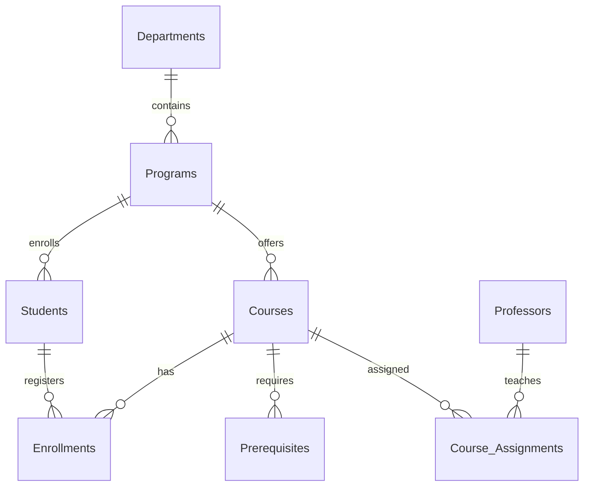
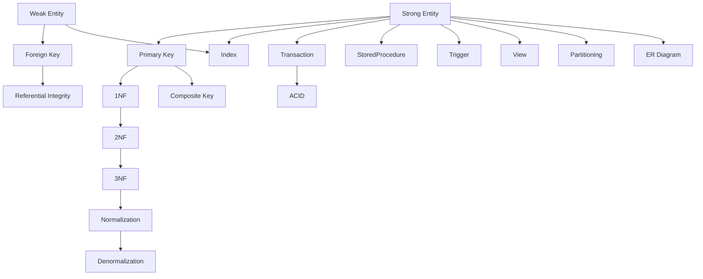

# MySQL Database Tutorial: Algonquin College Academic Management System

## 🚀 Level 6 (Create/Evaluate) Learning Outcomes

This guide is structured to help you **create**, **evaluate**, and **master** a normalized, secure, and scalable MySQL database for an academic management system. Each section is ordered to align with Bloom’s Taxonomy Tier 6, progressing from analysis and evaluation to creation and application.

---

## 1. Analyze & Evaluate: ER Diagram and Database Design

### Why ER Diagrams?

Entity-Relationship diagrams help visualize tables, relationships, and cardinality before coding. Analyzing these diagrams ensures your design is normalized and free from redundancy.



---

### Table Design Rationale & Key Terms

#### **Departments**
- **Why:** Represents academic divisions. Each department can offer multiple programs.
- **Design:** Strong entity with a surrogate key (`dept_id`), and a unique department name.
- **Key Terms:**
  - **Strong Entity:** Exists independently (see [Strong Entity](#strong-entity)).
  - **Surrogate Key:** System-generated unique identifier (`dept_id`).

#### **Programs**
- **Why:** Represents academic programs within departments. Each program belongs to one department.
- **Design:** Strong entity with a surrogate key (`program_id`), unique name, minimum credits, and foreign key to Departments.
- **Key Terms:**
  - **Foreign Key:** Links to Departments (`dept_id`), enforcing referential integrity.
  - **Normalization:** Separates Programs from Departments to avoid redundancy.

#### **Students**
- **Why:** Represents learners enrolled in programs. Each student is in one program.
- **Design:** Strong entity with a natural key (`student_id`), personal info, and foreign key to Programs.
- **Key Terms:**
  - **Strong Entity:** Independent existence.
  - **Natural Key:** Real-world identifier (`student_id`).
  - **Derived Attribute:** Age can be calculated from `birth_date`.

#### **Professors**
- **Why:** Represents faculty members. Each professor belongs to a department.
- **Design:** Strong entity with surrogate key (`professor_id`), personal info, and foreign key to Departments.
- **Key Terms:**
  - **Surrogate Key:** `professor_id` auto-increment.
  - **Foreign Key:** `department_id` links to Departments.

#### **Courses**
- **Why:** Represents courses offered by programs. Each course has a unique code.
- **Design:** Strong entity with a natural key (`course_code`), title, credits, and description.
- **Key Terms:**
  - **Strong Entity:** Exists independently.
  - **Check Constraint:** Ensures course code format and credit range.

#### **Enrollments**
- **Why:** Tracks which students are registered in which courses and semesters.
- **Design:** Weak entity with surrogate key (`enrollment_id`), foreign keys to Students and Courses, semester, and grade.
- **Key Terms:**
  - **Weak Entity:** Depends on Students and Courses.
  - **Foreign Key:** Links to Students and Courses.
  - **Surrogate Key:** `enrollment_id` as unique identifier.
  - **Composite Key (alternative):** Could use (student_id, course_code, semester).

#### **Prerequisites**
- **Why:** Models course prerequisite relationships.
- **Design:** Weak entity with composite primary key (`course_code`, `prereq_code`), both foreign keys to Courses.
- **Key Terms:**
  - **Composite Key:** Combination of `course_code` and `prereq_code`.
  - **Referential Integrity:** Both columns reference Courses.

#### **Course_Assignments**
- **Why:** Tracks which professors teach which courses in which semesters.
- **Design:** Weak entity with surrogate key (`assignment_id`), foreign keys to Courses and Professors, and semester.
- **Key Terms:**
  - **Surrogate Key:** `assignment_id`.
  - **Foreign Key:** Links to Courses and Professors.

---

## 🎓 Key Terminology

| Term              | Definition                                                | MySQL Example                                                     | College Example                      |
|-------------------|-----------------------------------------------------------|-------------------------------------------------------------------|--------------------------------------|
| Conceptual Design | High-level entities and interactions without attributes   | N/A                                                               | Initial ER diagram                   |
| Logical Design    | Adds attributes, keys, and data types                     | CREATE TABLE Students(...)                                        | Full ERD with attributes             |
| Physical Design   | DBMS-specific implementation                              | ENGINE=InnoDB, PARTITION BY RANGE                                 | Optimized schema                     |
| Max Cardinality   | Maximum relationships an entity can have (1 or M)         | Determined via "One Professor teaches ______ Courses"             | Professor-Course (1:M)               |
| Min Cardinality   | Whether relationship is mandatory (1) or optional (0)     | NOT NULL vs. NULL                                                 | Course requires Professor            |
| Strong Entity     | Independent objects that exist on their own               | CREATE TABLE Students (id INT PRIMARY KEY, ...);                  | Students table                       |
| Weak Entity       | Depends on a strong entity for existence                  | CREATE TABLE Enrollment (..., FOREIGN KEY...);                    | Enrollment records                   |
| Composite Key     | Primary key consisting of multiple columns                | PRIMARY KEY (student_id, course_code, semester)                   | Enrollment records                   |
| Surrogate Key     | System-generated meaningless identifier                   | professor_id INT AUTO_INCREMENT                                   | Professor IDs                        |
| Normalization     | Organizing data to minimize redundancy                    | -- 3NF implementation separating Students, Programs, Departments  | Academic structure                   |
| Derived Attribute | Calculated value not stored in DB                         | SELECT TIMESTAMPDIFF(YEAR, birth_date, CURDATE()) AS age          | Student age                          |

---

## 2. Create: Database Setup and Schema Implementation

### 2.1 MySQL Server Application & Workbench Navigation

- **Install MySQL Server & Workbench**
    - [MySQL Server Download](https://dev.mysql.com/downloads/mysql/)
    - [Workbench Download](https://dev.mysql.com/downloads/workbench/)
- **Launch MySQL Server Application**
    - Windows: Open "MySQL Installer" or "MySQL Notifier"
    - macOS/Linux: `sudo systemctl start mysql`
- **Verify Server is Running**: Connect via Workbench and open the SQL editor.

### 2.2 Create Database and Admin User

```sql
CREATE DATABASE algonquin COLLATE utf8mb4_unicode_ci;
USE algonquin;

CREATE USER 'ac_admin'@'localhost' IDENTIFIED BY 'secure_password_123';
GRANT ALL PRIVILEGES ON algonquin.* TO 'ac_admin'@'localhost';
FLUSH PRIVILEGES;
```

### 2.3 Create Strong Entities

### 🏗️ Departments Table
```sql
CREATE TABLE Departments (
    dept_id INT AUTO_INCREMENT PRIMARY KEY,
    name VARCHAR(50) NOT NULL UNIQUE
) ENGINE=InnoDB;
```
- **Why exist?** Foundation of academic structure; prevents duplicate department info across programs.
- **Relationship:** Parent entity for Programs/Professors; enables college-wide reporting.
- **Key Variables:** `name` (unique constraint prevents duplicates).
- **MySQL Tip:** Use `AUTO_INCREMENT` surrogate keys instead of names as PK to simplify FK references.
---

### 🏗️ Programs Table
```sql
CREATE TABLE Programs (
    program_id INT AUTO_INCREMENT PRIMARY KEY,
    name VARCHAR(50) NOT NULL UNIQUE,
    min_credits INT DEFAULT 60 CHECK (min_credits >= 60),
    dept_id INT NOT NULL,
    FOREIGN KEY (dept_id) REFERENCES Departments(dept_id)
) ENGINE=InnoDB;
```
- **Why exist?** Models distinct academic pathways; separates program-specific logic from departments.
- **Relationship:** Bridge between Departments ↔ Students; enables "program enrollment" analytics.
- **Key Variables:** `min_credits` (`CHECK` constraint ensures ≥60).
- **Transferable:** Use `DEFAULT` constraints for business rules (e.g., default min credits).
---

### 🏗️ Students Table
```sql
CREATE TABLE Students (
    student_id BIGINT PRIMARY KEY CHECK (student_id BETWEEN 100000000 AND 999999999),
    first_name VARCHAR(50) NOT NULL,
    last_name VARCHAR(50) NOT NULL,
    email VARCHAR(120) UNIQUE CHECK (email REGEXP '^[a-z]+\\.[a-z]+@algonquinlive\\.com$'),
    program_id INT NOT NULL,
    birth_date DATE,
    enrollment_date DATE DEFAULT (CURRENT_DATE),
    FOREIGN KEY (program_id) REFERENCES Programs(program_id)
) ENGINE=InnoDB;
```
- **Why exist?** Core entity for all academic activities; centralizes student data.
- **Relationship:** Source for Enrollments; connects to Programs via `program_id`.
- **Key Variables:**  
    - `student_id` (natural key with `CHECK` for 9-digit format)  
    - `email` (`REGEXP` ensures institutional email format)
- **Cool Tip:** Compute age via `TIMESTAMPDIFF(YEAR, birth_date, CURDATE())` instead of storing it.
---

### 🏗️ Professors Table
```sql
CREATE TABLE Professors (
    professor_id INT AUTO_INCREMENT PRIMARY KEY,
    first_name VARCHAR(50) NOT NULL,
    last_name VARCHAR(50) NOT NULL,
    email VARCHAR(120) UNIQUE CHECK (email LIKE '%@algonquinlive.com'),
    department_id INT NOT NULL,
    hire_date DATE,
    FOREIGN KEY (department_id) REFERENCES Departments(dept_id)
) ENGINE=InnoDB;
```
- **Why exist?** Manages faculty assignments; separates HR data from course logic.
- **Relationship:** Linked to Departments; source for Course_Assignments.
- **Key Variables:** `email` (`LIKE` constraint for domain validation).
- **MySQL Tip:** Surrogate `professor_id` simplifies assignments even if professor names change.
```sql
---

### 🏗️ Courses Table
CREATE TABLE Courses (
    course_code CHAR(7) PRIMARY KEY CHECK (course_code REGEXP '^[A-Z]{3}[0-9]{4}$'),
    title VARCHAR(100) NOT NULL,
    credits INT NOT NULL CHECK (credits BETWEEN 1 AND 6),
    description TEXT
) ENGINE=InnoDB;
```
- **Why exist?** Catalog master; ensures course consistency across enrollments/prerequisites.
- **Relationship:** Hub for Enrollments, Prerequisites, and Assignments.
- **Key Variables:**  
    - `course_code` (natural key with `REGEXP` for format validation)  
    - `credits` (`CHECK` constraint limits 1-6 credits)
- **Transferable:** Use `CHAR` for fixed-length codes (faster joins than `VARCHAR`).
---

### 2.4 Create Weak Entities & Relationships

### 🔗 Enrollments Table
```sql
CREATE TABLE Enrollments (
    enrollment_id INT AUTO_INCREMENT PRIMARY KEY,
    student_id BIGINT NOT NULL,
    course_code CHAR(7) NOT NULL,
    semester CHAR(5) NOT NULL CHECK (semester REGEXP '^[FWS][0-9]{4}$'),
    grade CHAR(2) CHECK (grade IN ('A+', 'A', 'B+', 'B', 'C+', 'C', 'D+', 'D', 'F', 'W')),
    FOREIGN KEY (student_id) REFERENCES Students(student_id) ON DELETE CASCADE,
    FOREIGN KEY (course_code) REFERENCES Courses(course_code)
) ENGINE=InnoDB;
```
- **Why exist?** Resolves M:N relationship between Students ↔ Courses; tracks academic history.
- **Relationship:** Depends on Students/Courses; enables transcript generation.
- **Key Variables:**  
    - `semester` (`REGEXP` validates term format like W2024)  
    - `grade` (`CHECK` for valid grade codes)
- **ON DELETE CASCADE:** Auto-purges enrollments if students leave.
- **Cool Tip:** Use composite index on `(student_id, semester)` for fast transcript queries.
---

### 🔗 Prerequisites Table
```sql
CREATE TABLE Prerequisites (
    course_code CHAR(7) NOT NULL,
    prereq_code CHAR(7) NOT NULL,
    PRIMARY KEY (course_code, prereq_code),
    FOREIGN KEY (course_code) REFERENCES Courses(course_code),
    FOREIGN KEY (prereq_code) REFERENCES Courses(course_code)
) ENGINE=InnoDB;
```
- **Why exist?** Models recursive course dependencies; prevents circular references.
- **Relationship:** Self-referencing to Courses; enforces curriculum integrity.
- **Key Variables:** Composite PK (`course_code`, `prereq_code`).
- **MySQL Tip:** Add trigger to prevent `course_code = prereq_code` loops.
---

### 🔗 Course_Assignments Table
```sql
CREATE TABLE Course_Assignments (
    assignment_id INT AUTO_INCREMENT PRIMARY KEY,
    course_code CHAR(7) NOT NULL,
    professor_id INT NOT NULL,
    semester CHAR(5) NOT NULL,
    FOREIGN KEY (course_code) REFERENCES Courses(course_code),
    FOREIGN KEY (professor_id) REFERENCES Professors(professor_id)
) ENGINE=InnoDB;
```
- **Why exist?** Resolves M:N between Professors ↔ Courses; tracks teaching workload.
- **Relationship:** Depends on Professors/Courses; enables faculty analytics.
- **Key Variables:** `semester` (consistent format with Enrollments).
- **Transferable:** Use weak entities for all M:N relationships (e.g., orders-products in e-commerce).

---

## 3. Evaluate: Optimizations & Security

### 3.1 Indexes

```sql
CREATE INDEX idx_student_name ON Students(last_name, first_name);
CREATE INDEX idx_course_title ON Courses(title);
CREATE INDEX idx_enrollment_semester ON Enrollments(semester);
CREATE INDEX idx_enrollment_grade ON Enrollments(grade);
```

### ⚙️ Index Strategy
- **Critical Variables:** `last_name`, `first_name` (covers name searches), `semester` (high-filter queries).
- **Cool Tip:** Create indexes on all FK columns + frequently filtered columns like `grade`.

### 3.2 User Roles & Permissions

```sql
CREATE ROLE 'professor';
GRANT SELECT, UPDATE(grade) ON algonquin.Enrollments TO 'professor';

CREATE ROLE 'student';
GRANT SELECT ON algonquin.Courses TO 'student';
GRANT SELECT ON algonquin.Enrollments TO 'student';

CREATE USER 'dr_smith'@'localhost' IDENTIFIED BY 'prof_password';
GRANT 'professor' TO 'dr_smith'@'localhost';
```

### ⚙️ Role-Based Access
- **Why Roles?** Security principle of least privilege (e.g., professors can't modify grades).
- **MySQL Tip:** Create roles before users; grant privileges to roles.
- **Transferable Example:**
        ```sql
        CREATE ROLE 'web_app';
        GRANT SELECT, INSERT ON orders TO 'web_app';
        ```

---

## 4. Create: Stored Procedures & Functions

```sql
DELIMITER //

CREATE PROCEDURE RegisterStudent(
    IN student_id BIGINT,
    IN course_code CHAR(7),
    IN semester CHAR(5)
)
BEGIN
    INSERT INTO Enrollments (student_id, course_code, semester)
    VALUES (student_id, course_code, semester);
END //

CREATE FUNCTION CalculateGPA(student BIGINT) 
RETURNS DECIMAL(3,2)
DETERMINISTIC
BEGIN
    DECLARE total_points DECIMAL(10,2) DEFAULT 0;
    DECLARE total_credits INT DEFAULT 0;
    
    SELECT SUM(
        CASE grade
            WHEN 'A+' THEN 4.5 * credits
            WHEN 'A'  THEN 4.0 * credits
            WHEN 'B+' THEN 3.5 * credits
            WHEN 'B'  THEN 3.0 * credits
            WHEN 'C+' THEN 2.5 * credits
            WHEN 'C'  THEN 2.0 * credits
            WHEN 'D+' THEN 1.5 * credits
            WHEN 'D'  THEN 1.0 * credits
            ELSE 0
        END
    ), SUM(credits)
    INTO total_points, total_credits
    FROM Enrollments e
    JOIN Courses c ON e.course_code = c.course_code
    WHERE e.student_id = student AND grade NOT IN ('W', 'F');
    
    RETURN total_points / NULLIF(total_credits, 0);
END //

DELIMITER ;
```

## Complete ER Diagram with Attributes (Mermaid Syntax)
```mermaid
erDiagram
erDiagram
    Departments {
        INT dept_id PK "AUTO_INCREMENT"
        VARCHAR(50) name "UNIQUE NOT NULL"
    }
    
    Programs {
        INT program_id PK "AUTO_INCREMENT"
        VARCHAR(50) name "UNIQUE NOT NULL"
        INT min_credits "DEFAULT 60, CHECK ≥60"
        INT dept_id FK "NOT NULL"
    }
    
    Students {
        BIGINT student_id PK "CHECK 9-digit"
        VARCHAR(50) first_name "NOT NULL"
        VARCHAR(50) last_name "NOT NULL"
        VARCHAR(120) email "UNIQUE, INSTITUTIONAL FORMAT"
        INT program_id FK "NOT NULL"
        DATE birth_date
        DATE enrollment_date "DEFAULT CURRENT_DATE"
    }
    
    Professors {
        INT professor_id PK "AUTO_INCREMENT"
        VARCHAR(50) first_name "NOT NULL"
        VARCHAR(50) last_name "NOT NULL"
        VARCHAR(120) email "UNIQUE, INSTITUTIONAL FORMAT"
        INT department_id FK "NOT NULL"
        DATE hire_date
    }
    
    Courses {
        CHAR(7) course_code PK "FORMAT XXX####"
        VARCHAR(100) title "NOT NULL"
        INT credits "CHECK 1-6"
        TEXT description
    }
    
    Enrollments {
        INT enrollment_id PK "AUTO_INCREMENT"
        BIGINT student_id FK "NOT NULL"
        CHAR(7) course_code FK "NOT NULL"
        CHAR(5) semester "FORMAT [FWS]YYYY"
        CHAR(2) grade "VALID GRADE VALUES"
    }
    
    Prerequisites {
        CHAR(7) course_code FK "NOT NULL"
        CHAR(7) prereq_code FK "NOT NULL"
    }
    
    Course_Assignments {
        INT assignment_id PK "AUTO_INCREMENT"
        CHAR(7) course_code FK "NOT NULL"
        INT professor_id FK "NOT NULL"
        CHAR(5) semester "FORMAT [FWS]YYYY"
    }
    
    Departments ||--o{ Programs : "1:N\ncontains"
    Departments ||--o{ Professors : "1:N\nemploys"
    Programs ||--o{ Students : "1:N\nenrolls"
    Programs ||--o{ Courses : "1:N\noffers"
    Students ||--o{ Enrollments : "1:N\nregisters"
    Courses ||--o{ Enrollments : "1:N\nhas"
    Courses ||--|| Prerequisites : "M:N\nrequires"
    Professors ||--o{ Course_Assignments : "1:N\nteaches"
    Courses ||--o{ Course_Assignments : "1:N\nassigned"
```

## Full Schema Visualization (Markdown Table)

| Table               | Columns (PK in **bold**, FK in *italic*)                                                                 | Data Types & Constraints                                                                                  | Relationships                                 |
|---------------------|---------------------------------------------------------------------------------------------------------|-----------------------------------------------------------------------------------------------------------|-----------------------------------------------|
| Departments         | **dept_id**, name                                                                                       | INT AI, VARCHAR(50) UNIQUE NOT NULL                                                                       | Parent to Programs, Professors                |
| Programs            | **program_id**, name, min_credits, *dept_id*                                                            | INT AI, VARCHAR(50) UNIQUE NOT NULL, INT DEFAULT 60 CHECK ≥60, INT NOT NULL                               | Child of Departments, Parent to Students      |
| Students            | **student_id**, first_name, last_name, email, *program_id*, birth_date, enrollment_date                 | BIGINT (9-digit), VARCHAR(50) NOT NULL, VARCHAR(120) UNIQUE (institutional format), INT NOT NULL, DATE, DATE DEFAULT CURRENT_DATE | Child of Programs, Parent to Enrollments      |
| Professors          | **professor_id**, first_name, last_name, email, *department_id*, hire_date                              | INT AI, VARCHAR(50) NOT NULL, VARCHAR(120) UNIQUE (institutional format), INT NOT NULL, DATE              | Child of Departments, Parent to Course_Assignments |
| Courses             | **course_code**, title, credits, description                                                            | CHAR(7) (XXX####), VARCHAR(100) NOT NULL, INT CHECK 1-6, TEXT                                             | Parent to Enrollments, Prerequisites, Course_Assignments |
| Enrollments         | **enrollment_id**, *student_id*, *course_code*, semester, grade                                         | INT AI, BIGINT NOT NULL, CHAR(7) NOT NULL, CHAR(5) [FWS]YYYY, CHAR(2) (valid grades)                      | Weak entity (Students × Courses)              |
| Prerequisites       | **course_code**, **prereq_code**                                                                        | CHAR(7) NOT NULL (both), COMPOSITE PK                                                                     | Recursive M:N relationship on Courses         |
| Course_Assignments  | **assignment_id**, *course_code*, *professor_id*, semester                                              | INT AI, CHAR(7) NOT NULL, INT NOT NULL, CHAR(5) [FWS]YYYY                                                 | Weak entity (Professors × Courses)            |

---

## 5. Apply: Insert Sample Data

```sql
INSERT INTO Departments (name) VALUES 
('School of Advanced Technology'),
('School of Business'),
('School of Health Sciences');

INSERT INTO Programs (name, min_credits, dept_id) VALUES
('Computer Programming', 60, 1),
('Business Administration', 60, 2),
('Nursing', 75, 3);

INSERT INTO Courses (course_code, title, credits) VALUES
('CST8284', 'Database Systems', 3),
('CST8285', 'Web Programming', 3),
('BUS2301', 'Business Communications', 4),
('NUR1010', 'Anatomy Fundamentals', 6);

INSERT INTO Students (student_id, first_name, last_name, email, program_id) VALUES
(100123456, 'John', 'Doe', 'john.doe@algonquinlive.com', 1),
(100654321, 'Jane', 'Smith', 'jane.smith@algonquinlive.com', 3);
```
### ⚙️ Stored Routines
- **Why Procedures?** Encapsulate business logic (e.g., enrollment validation rules).
- **Key Insight:** `DELIMITER` enables multi-statement procedures.
- **Transferable Example:** Use functions for calculations like:
        ```sql
        CREATE FUNCTION CalculateTax(price DECIMAL) 
        RETURNS DECIMAL DETERMINISTIC
        RETURN price * 0.13;
        ```

---

## 6. Apply & Evaluate: Example Queries

### 6.1 Student Course Load

```sql
SELECT s.first_name, s.last_name, 
         COUNT(e.course_code) AS num_courses,
         SUM(c.credits) AS total_credits
FROM Students s
JOIN Enrollments e ON s.student_id = e.student_id
JOIN Courses c ON e.course_code = c.course_code
WHERE e.semester = 'W2024'
GROUP BY s.student_id;
```

### 6.2 Prerequisite Check

```sql
SELECT s.student_id, s.first_name, s.last_name, c.title AS course
FROM Students s
JOIN Enrollments e ON s.student_id = e.student_id
JOIN Courses c ON e.course_code = c.course_code
WHERE EXISTS (
    SELECT 1 
    FROM Prerequisites p
    WHERE p.course_code = c.course_code
        AND p.prereq_code NOT IN (
            SELECT course_code 
            FROM Enrollments 
            WHERE student_id = s.student_id AND grade NOT IN ('F', 'W')
        )
);
```

### 6.3 Professor Workload

```sql
SELECT p.first_name, p.last_name, 
         COUNT(ca.course_code) AS courses_teaching
FROM Professors p
JOIN Course_Assignments ca ON p.professor_id = ca.professor_id
WHERE ca.semester = 'W2024'
GROUP BY p.professor_id;
```
---

## 6.4 Cross-Project Integration Tips

### 🔄 Regex Everywhere
- Use `REGEXP` constraints for:
        - Phone numbers: `'^[0-9]{3}-[0-9]{3}-[0-9]{4}$'`
        - ZIP codes: `'^[A-Z][0-9][A-Z] [0-9][A-Z][0-9]$'`
        - Product SKUs: `'^[A-Z]{3}-[0-9]{5}$'`

### 🔄 Normalization Patterns
- Replicate this structure for:
        - E-commerce: Customers → Orders → OrderItems → Products
        - Healthcare: Patients → Appointments → Treatments → Providers
- **Always:** Strong entities first → Weak entities for relationships

### 🔄 Backup Automation
- Create cron jobs/scheduled tasks:
        ```bash
        # Daily backup at 2 AM
        0 2 * * * mysqldump -u root -p dbname > /backups/db_$(date +\%F).sql
        ```

### 🔄 Indexing Strategy
- Universal principles:
        - Index all primary/foreign keys
        - Composite indexes on frequently filtered column groups
        - Use `EXPLAIN` to identify missing indexes

### 🔄 Audit Trail Pattern
- Add to key tables:
        ```sql
        ALTER TABLE Enrollments
        ADD updated_at TIMESTAMP DEFAULT CURRENT_TIMESTAMP ON UPDATE CURRENT_TIMESTAMP,
        ADD updated_by VARCHAR(45);
        ```

---

## 6.4 ER Diagram Application

- The same visualization approach works for:
        - **Hospital Systems:**
                ```mermaid
                erDiagram
                        Departments ||--o{ Doctors : employs
                        Patients ||--o{ Appointments : schedules
                        Doctors ||--o{ Appointments : attends
                ```
        - **Inventory Management:**
                ```mermaid
                erDiagram
                        Warehouses ||--o{ Inventory : stores
                        Products ||--o{ Inventory : contains
                        Suppliers ||--o{ PurchaseOrders : supplies
                ```

---


## 7. Maintain & Optimize: Maintenance & Backup

### 7.1 Backup Database

```bash
mysqldump -u ac_admin -p algonquin > algonquin_backup_$(date +%F).sql
```

### 7.2 Optimize Tables

```sql
OPTIMIZE TABLE Students, Enrollments, Courses;
```

---

## 7.3 Security Best Practices

- Always use `CREATE ROLE` → `GRANT` → `CREATE USER` pattern.
- Never store plaintext passwords:
        ```sql
        CREATE USER 'app_user'@'%' IDENTIFIED WITH mysql_native_password BY 'hashed_password';
        ```
- Mandatory `FLUSH PRIVILEGES` after permission changes.

---

## 8. Understand: Key Terms Index

| **Command/Concept**      | **Definition**                                                                 |
|--------------------------|-------------------------------------------------------------------------------|
| [`CREATE TABLE`](#create-table)        | Defines a new table in the database. |
| [`PRIMARY KEY`](#primary-key)          | Uniquely identifies each row in a table. |
| [`FOREIGN KEY`](#foreign-key)          | Enforces a link between tables. |
| [`INDEX`](#index)                      | Improves query speed by allowing faster lookups. |
| [`CHECK`](#check)                      | Restricts values allowed in a column. |
| [`AUTO_INCREMENT`](#auto-increment)    | Automatically increases integer value for new rows. |
| [`UNIQUE`](#unique)                    | Ensures all values in a column are different. |
| [`ENGINE=InnoDB`](#engineinnodb)       | Sets the storage engine for the table. |
| [`CREATE USER`](#create-user)          | Adds a new user to the MySQL server. |
| [`GRANT`](#grant)                      | Gives privileges to users or roles. |
| [`CREATE ROLE`](#create-role)          | Defines a set of privileges that can be assigned to users. |
| [`DELIMITER`](#delimiter)              | Changes the statement delimiter (for procedures/functions). |
| [`CREATE PROCEDURE`](#create-procedure)| Defines a stored procedure (reusable SQL logic). |
| [`CREATE FUNCTION`](#create-function)  | Defines a stored function (returns a value). |
| [`INSERT INTO`](#insert-into)          | Adds new rows to a table. |
| [`SELECT`](#select)                    | Retrieves data from one or more tables. |
| [`DROP`](#drop)                        | Removes a database, table, user, or role. |
| [`ALTER`](#alter)                      | Modifies an existing database object. |
| [`PARTITION BY`](#partition-by)        | Splits table data for performance. |
| [`VIEW`](#view)                        | Creates a virtual table based on a query. |
| [`TRIGGER`](#trigger)                  | Executes logic automatically on table events. |
| [`TRANSACTION`](#transaction)          | Groups SQL statements to execute as a unit. |
| [`ACID`](#acid)                        | Atomicity, Consistency, Isolation, Durability (transaction properties). |
| [`mysqldump`](#mysqldump)              | Command-line tool to back up a MySQL database. |

---

## 9. Understand: Concepts, Definitions, and Examples

| **Command/Concept**      | **Definition**                                                                 | **MySQL Example**                                                                                       | **Project Example**                                                                                   |
|--------------------------|-------------------------------------------------------------------------------|---------------------------------------------------------------------------------------------------------|-------------------------------------------------------------------------------------------------------|
| [`Strong Entity`](#create-table)        | Table with its own primary key, independent existence                         | [`CREATE TABLE`](#create-table) Departments (...);                                                                       | [`CREATE TABLE`](#create-table) Students (...);                                                                        |
| [`Weak Entity`](#foreign-key)          | Table dependent on another table (uses FK)                                    | [`CREATE TABLE`](#create-table) Enrollments (..., [`FOREIGN KEY`](#foreign-key) (student_id) REFERENCES Students(student_id));             | [`CREATE TABLE`](#create-table) Prerequisites (...);                                                                   |
| [`Primary Key (PK)`](#primary-key)     | Uniquely identifies each row in a table                                       | [`PRIMARY KEY`](#primary-key) (dept_id)                                                                                 | [`PRIMARY KEY`](#primary-key) (student_id)                                                                            |
| [`Foreign Key (FK)`](#foreign-key)     | Enforces link between tables                                                  | [`FOREIGN KEY`](#foreign-key) (dept_id) REFERENCES Departments(dept_id)                                                 | [`FOREIGN KEY`](#foreign-key) (program_id) REFERENCES Programs(program_id)                                            |
| [`1NF`](#create-table)                  | Atomic columns, no repeating groups                                           | [`CREATE TABLE`](#create-table) Courses (title VARCHAR(100));                                                            | Each course has one title, not a list                                                                 |
| [`2NF`](#create-table)                  | 1NF + no partial dependency on PK                                             | Split tables to remove partial dependencies                                                             | Separate Programs and Departments tables                                                          |
| [`3NF`](#create-table)                  | 2NF + no transitive dependency                                                | Remove columns dependent on non-PK attributes                                                           | Move department name to Departments table                                                           |
| [`Index`](#index)                | Improves query speed                                                          | [`CREATE INDEX`](#index) idx_name ON Students(last_name);                                                         | [`CREATE INDEX`](#index) idx_enrollment_grade ON Enrollments(grade);                                            |
| [`Transaction`](#transaction)          | Group of SQL statements executed as a unit                                    | `START TRANSACTION; ... COMMIT;`                                                                        | Enroll student and update seat count together                                                         |
| [`ACID Properties`](#acid)      | Atomicity, Consistency, Isolation, Durability                                 | Use transactions and InnoDB engine                                                                      | All enrollment steps succeed or fail together                                                         |
| [`Stored Procedure`](#create-procedure)     | Saved SQL logic for reuse                                                     | [`CREATE PROCEDURE`](#create-procedure) RegisterStudent(...) BEGIN ... END;                                                  | `CALL RegisterStudent(100123456, 'CST8284', 'W2024');`                                                |
| [`Trigger`](#trigger)              | Auto-executes on table events                                                 | [`CREATE TRIGGER`](#trigger) before_insert ...                                                                      | Update seat count after enrollment                                                                    |
| [`View`](#view)                 | Virtual table based on query                                                  | [`CREATE VIEW`](#view) StudentCourses AS SELECT ...                                                              | [`CREATE VIEW`](#view) ProgramSummary AS SELECT ...                                                            |
| [`Partitioning`](#partition-by)         | Splits table data for performance                                             | [`CREATE TABLE`](#create-table) Enrollments (...) [`PARTITION BY`](#partition-by) RANGE (semester);                                         | Partition enrollments by semester                                                                     |
| [`Normalization`](#create-table)        | Process to reduce redundancy, improve integrity                               | Apply 1NF, 2NF, 3NF steps                                                                               | Separate Departments, Programs, Courses                                                         |
| [`Denormalization`](#create-table)      | Add redundancy for performance                                                | Add department name to Programs table                                                                 | Store department name in Programs for faster reads                                                  |
| [`ER Diagram`](#er-diagram)           | Visual representation of entities/relations                                   | Use MySQL Workbench ERD tool                                                                            | Diagram showing Students, Courses, Enrollments                                                  |
| [`Composite Key`](#primary-key)        | PK made of multiple columns                                                   | [`PRIMARY KEY`](#primary-key) (course_code, prereq_code)                                                                | Prerequisites table PK                                                                              |
| [`Referential Integrity`](#foreign-key)| Ensures FK values exist in parent table                                       | [`FOREIGN KEY`](#foreign-key) (dept_id) REFERENCES Departments(dept_id)                                                 | Can't assign a program to a non-existent department                                                   |

---

## 10. Visualize: MySQL Concepts Map



---

## 11. Synthesize: Auto-Configuration Script

```sql
-- 1. DATABASE SETUP
DROP DATABASE IF EXISTS algonquin;
CREATE DATABASE algonquin COLLATE utf8mb4_unicode_ci;
USE algonquin;

-- Create admin user
DROP USER IF EXISTS 'ac_admin'@'localhost';
CREATE USER 'ac_admin'@'localhost' IDENTIFIED BY 'secure_password_123';
GRANT ALL PRIVILEGES ON algonquin.* TO 'ac_admin'@'localhost';
FLUSH PRIVILEGES;

-- 2. CREATE STRONG ENTITIES
CREATE TABLE Departments (
    dept_id INT AUTO_INCREMENT PRIMARY KEY,
    name VARCHAR(50) NOT NULL UNIQUE
) ENGINE=InnoDB;

CREATE TABLE Programs (
    program_id INT AUTO_INCREMENT PRIMARY KEY,
    name VARCHAR(50) NOT NULL UNIQUE,
    min_credits INT DEFAULT 60 CHECK (min_credits >= 60),
    dept_id INT NOT NULL,
    FOREIGN KEY (dept_id) REFERENCES Departments(dept_id)
) ENGINE=InnoDB;

CREATE TABLE Courses (
    course_code CHAR(7) PRIMARY KEY CHECK (course_code REGEXP '^[A-Z]{3}[0-9]{4}$'),
    title VARCHAR(100) NOT NULL,
    credits INT NOT NULL CHECK (credits BETWEEN 1 AND 6),
    description TEXT
) ENGINE=InnoDB;

CREATE TABLE Students (
    student_id BIGINT PRIMARY KEY CHECK (student_id BETWEEN 100000000 AND 999999999),
    first_name VARCHAR(50) NOT NULL,
    last_name VARCHAR(50) NOT NULL,
    email VARCHAR(120) UNIQUE CHECK (email REGEXP '^[a-z]+\\.[a-z]+@algonquinlive\\.com$'),
    program_id INT NOT NULL,
    birth_date DATE,
    enrollment_date DATE DEFAULT (CURRENT_DATE),
    FOREIGN KEY (program_id) REFERENCES Programs(program_id)
) ENGINE=InnoDB;

CREATE TABLE Professors (
    professor_id INT AUTO_INCREMENT PRIMARY KEY,
    first_name VARCHAR(50) NOT NULL,
    last_name VARCHAR(50) NOT NULL,
    email VARCHAR(120) UNIQUE CHECK (email LIKE '%@algonquinlive.com'),
    department_id INT NOT NULL,
    hire_date DATE,
    FOREIGN KEY (department_id) REFERENCES Departments(dept_id)
) ENGINE=InnoDB;

-- 3. WEAK ENTITIES & RELATIONSHIPS
CREATE TABLE Enrollments (
    enrollment_id INT AUTO_INCREMENT PRIMARY KEY,
    student_id BIGINT NOT NULL,
    course_code CHAR(7) NOT NULL,
    semester CHAR(5) NOT NULL CHECK (semester REGEXP '^[FWS][0-9]{4}$'),
    grade CHAR(2) CHECK (grade IN ('A+', 'A', 'B+', 'B', 'C+', 'C', 'D+', 'D', 'F', 'W')),
    FOREIGN KEY (student_id) REFERENCES Students(student_id) ON DELETE CASCADE,
    FOREIGN KEY (course_code) REFERENCES Courses(course_code)
) ENGINE=InnoDB;

CREATE TABLE Prerequisites (
    course_code CHAR(7) NOT NULL,
    prereq_code CHAR(7) NOT NULL,
    PRIMARY KEY (course_code, prereq_code),
    FOREIGN KEY (course_code) REFERENCES Courses(course_code),
    FOREIGN KEY (prereq_code) REFERENCES Courses(course_code)
) ENGINE=InnoDB;

CREATE TABLE Course_Assignments (
    assignment_id INT AUTO_INCREMENT PRIMARY KEY,
    course_code CHAR(7) NOT NULL,
    professor_id INT NOT NULL,
    semester CHAR(5) NOT NULL,
    FOREIGN KEY (course_code) REFERENCES Courses(course_code),
    FOREIGN KEY (professor_id) REFERENCES Professors(professor_id)
) ENGINE=InnoDB;

-- 4. OPTIMIZATIONS & SECURITY
CREATE INDEX idx_student_name ON Students(last_name, first_name);
CREATE INDEX idx_course_title ON Courses(title);
CREATE INDEX idx_enrollment_semester ON Enrollments(semester);
CREATE INDEX idx_enrollment_grade ON Enrollments(grade);

DROP ROLE IF EXISTS 'professor', 'student';
CREATE ROLE 'professor';
GRANT SELECT, UPDATE(grade) ON algonquin.Enrollments TO 'professor';

CREATE ROLE 'student';
GRANT SELECT ON algonquin.Courses TO 'student';
GRANT SELECT ON algonquin.Enrollments TO 'student';

DROP USER IF EXISTS 'dr_smith'@'localhost';
CREATE USER 'dr_smith'@'localhost' IDENTIFIED BY 'prof_password';
GRANT 'professor' TO 'dr_smith'@'localhost';

DELIMITER //
CREATE PROCEDURE RegisterStudent(
    IN student_id BIGINT,
    IN course_code CHAR(7),
    IN semester CHAR(5)
)
BEGIN
    INSERT INTO Enrollments (student_id, course_code, semester)
    VALUES (student_id, course_code, semester);
END //

CREATE FUNCTION CalculateGPA(student BIGINT) RETURNS DECIMAL(3,2)
DETERMINISTIC
BEGIN
    DECLARE total_points DECIMAL(10,2) DEFAULT 0;
    DECLARE total_credits INT DEFAULT 0;
    
    SELECT SUM(
        CASE grade
            WHEN 'A+' THEN 4.5 * credits
            WHEN 'A'  THEN 4.0 * credits
            WHEN 'B+' THEN 3.5 * credits
            WHEN 'B'  THEN 3.0 * credits
            WHEN 'C+' THEN 2.5 * credits
            WHEN 'C'  THEN 2.0 * credits
            WHEN 'D+' THEN 1.5 * credits
            WHEN 'D'  THEN 1.0 * credits
            ELSE 0
        END
    ), SUM(credits)
    INTO total_points, total_credits
    FROM Enrollments e
    JOIN Courses c ON e.course_code = c.course_code
    WHERE e.student_id = student AND grade NOT IN ('W', 'F');
    
    RETURN total_points / NULLIF(total_credits, 0);
END //
DELIMITER ;

-- 5. SAMPLE DATA
INSERT INTO Departments (name) VALUES 
('School of Advanced Technology'),
('School of Business'),
('School of Health Sciences');

INSERT INTO Programs (name, min_credits, dept_id) VALUES
('Computer Programming', 60, 1),
('Business Administration', 60, 2),
('Nursing', 75, 3);

INSERT INTO Courses (course_code, title, credits) VALUES
('CST8284', 'Database Systems', 3),
('CST8285', 'Web Programming', 3),
('BUS2301', 'Business Communications', 4),
('NUR1010', 'Anatomy Fundamentals', 6);

INSERT INTO Students (student_id, first_name, last_name, email, program_id) VALUES
(100123456, 'John', 'Doe', 'john.doe@algonquinlive.com', 1),
(100654321, 'Jane', 'Smith', 'jane.smith@algonquinlive.com', 3);

-- 6. VERIFICATION QUERIES
SELECT 'Database created successfully!' AS Status;

-- Example query: List all programs
SELECT p.name AS program, d.name AS department, p.min_credits
FROM Programs p
JOIN Departments d ON p.dept_id = d.dept_id;

-- Backup command reminder (run in terminal)
SELECT CONCAT('mysqldump -u ac_admin -p algonquin > algonquin_backup_', DATE_FORMAT(NOW(), '%Y-%m-%d'), '.sql') 
AS 'Backup Command';
```

---

## 12. Remember: Footnotes for Key Terms

- <a name="create-table"></a>**CREATE TABLE**: Defines a new table in the database.
- <a name="primary-key"></a>**PRIMARY KEY**: Uniquely identifies each row in a table.
- <a name="foreign-key"></a>**FOREIGN KEY**: Enforces a link between tables.
- <a name="index"></a>**INDEX**: Improves query speed by allowing faster lookups.
- <a name="check"></a>**CHECK**: Restricts values allowed in a column.
- <a name="auto-increment"></a>**AUTO_INCREMENT**: Automatically increases integer value for new rows.
- <a name="unique"></a>**UNIQUE**: Ensures all values in a column are different.
- <a name="engineinnodb"></a>**ENGINE=InnoDB**: Sets the storage engine for the table.
- <a name="create-user"></a>**CREATE USER**: Adds a new user to the MySQL server.
- <a name="grant"></a>**GRANT**: Gives privileges to users or roles.
- <a name="create-role"></a>**CREATE ROLE**: Defines a set of privileges that can be assigned to users.
- <a name="delimiter"></a>**DELIMITER**: Changes the statement delimiter (for procedures/functions).
- <a name="create-procedure"></a>**CREATE PROCEDURE**: Defines a stored procedure (reusable SQL logic).
- <a name="create-function"></a>**CREATE FUNCTION**: Defines a stored function (returns a value).
- <a name="insert-into"></a>**INSERT INTO**: Adds new rows to a table.
- <a name="select"></a>**SELECT**: Retrieves data from one or more tables.
- <a name="drop"></a>**DROP**: Removes a database, table, user, or role.
- <a name="alter"></a>**ALTER**: Modifies an existing database object.
- <a name="partition-by"></a>**PARTITION BY**: Splits table data for performance.
- <a name="view"></a>**VIEW**: Creates a virtual table based on a query.
- <a name="trigger"></a>**TRIGGER**: Executes logic automatically on table events.
- <a name="transaction"></a>**TRANSACTION**: Groups SQL statements to execute as a unit.
- <a name="acid"></a>**ACID**: Atomicity, Consistency, Isolation, Durability (transaction properties).
- <a name="mysqldump"></a>**mysqldump**: Command-line tool to back up a MySQL database.
- <a name="er-diagram"></a>**ER Diagram**: Visual representation of entities and their relationships.

---

## 13. Next Steps

- Experiment with more complex queries.
- Try reverse engineering ER diagrams in Workbench (`Database > Reverse Engineer`).
- Build a simple frontend to interact with your database.

---

> **Tip:**  
> On GitHub, you can hover over any linked command (e.g., [`CREATE TABLE`](#create-table)) to see its definition in the Key Terms Index or Footnotes above.

