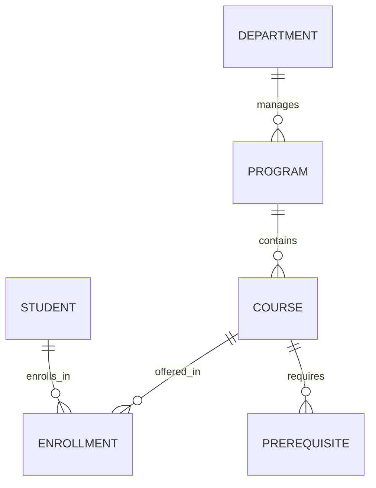
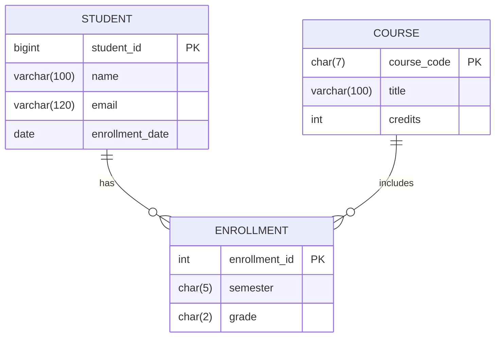

```markdown
# Database Design Study Guide (Algonquin College Example)

## 📌 Table of Contents
1. [Project Overview](#-project-overview)
2. [Database Design Roadmap](#-database-design-roadmap)
3. [Complete ER Diagram](#-complete-er-diagram)
4. [Normalization Process](#-normalization-process)
5. [SQL Schema Implementation](#-sql-schema-implementation)
6. [Optimization Techniques](#-optimization-techniques)
7. [Sample Queries](#-sample-queries)
8. [Entity Types](#-entity-types)
9. [Database Implementation Roadmap](#-database-implementation-roadmap)
10. [Requirements Gathering Techniques](#-requirements-gathering-techniques)
11. [Repository Structure](#-repository-structure)

---

## 🔍 Project Overview

**Scenario:** Algonquin College Academic Management System  
**Purpose:** Design a database to track students, courses, professors, and enrollments with college-specific rules.

**Key Features:**
- Student enrollment tracking
- Course prerequisites management
- Semester-based grade recording
- Algonquin-specific data validation (email formats, course codes)

**Business Rules:**
- Students have Algonquin emails (`firstname.lastname@algonquinlive.com`)
- Course codes follow `AAA####` pattern (e.g., `CST8284`)
- Programs require minimum 60 credits for diplomas

---
```

## 🗺 Database Design Roadmap

### 1. Identify Requirements

**Entity List:**

| Entity       | Description                          | Type          |
|--------------|--------------------------------------|--------------|
| `Student`    | 9-digit student ID                   | Strong Entity |
| `Professor`  | Faculty teaching courses             | Strong Entity |
| `Course`     | Courses with program mapping         | Strong Entity |
| `Enrollment` | Semester registrations               | Weak Entity   |

```



## 📊 Complete ER Diagram



# 🔄 Normalization Process

**Before Normalization**

```txt
students (denormalized)
---------
id | name | courses_taken (CSV) | program_name | dean
```

**Normalization Steps**

- 1NF:
    - Split CSV courses → Enrollment table
    - Atomic values in all columns
- 2NF:
    - Move program_name to Programs table
    - Remove partial dependencies
- 3NF:
    - Create Departments table
    - Eliminate transitive dependencies (program → dean)

**Normalized Schema Preview:**

```sql
CREATE TABLE Programs (
    program_id INT PRIMARY KEY,
    name VARCHAR(50) NOT NULL,
    dept_id INT REFERENCES Departments(dept_id)
);
```

## 💻 SQL Schema Implementation

**Core Tables (MySQL)**

```sql
-- Students with email validation
CREATE TABLE Students (
    student_id BIGINT PRIMARY KEY 
        CHECK (student_id BETWEEN 100000000 AND 999999999),
    name VARCHAR(100) NOT NULL,
    email VARCHAR(120) UNIQUE 
        CHECK (email REGEXP '^[a-z]+\\.[a-z]+@algonquinlive\\.com$'),
    program_id INT REFERENCES Programs(program_id)
) ENGINE=InnoDB;

-- Courses with code validation
CREATE TABLE Courses (
    course_code CHAR(7) PRIMARY KEY 
        CHECK (course_code REGEXP '^[A-Z]{3}[0-9]{4}$'),
    title VARCHAR(100) NOT NULL,
    credits INT CHECK (credits BETWEEN 1 AND 6)
);
```

**Constraints & Relationships**

```sql
-- Enrollment with composite key
CREATE TABLE Enrollments (
    enrollment_id INT AUTO_INCREMENT,
    student_id BIGINT,
    course_code CHAR(7),
    semester CHAR(5) NOT NULL CHECK (semester REGEXP '^[FWS][0-9]{4}$'),
    PRIMARY KEY (enrollment_id, student_id, course_code),
    FOREIGN KEY (student_id) REFERENCES Students(student_id)
        ON DELETE CASCADE,
    FOREIGN KEY (course_code) REFERENCES Courses(course_code)
) PARTITION BY RANGE COLUMNS(semester) (
    PARTITION p2023 VALUES LESS THAN ('W2024'),
    PARTITION p2024 VALUES LESS THAN ('W2025')
);
```

# ⚡ Optimization Techniques

**Indexing Strategy**

```sql
-- Frequently queried columns
CREATE INDEX idx_student_program ON Students(program_id);
CREATE INDEX idx_course_credits ON Courses(credits) WHERE credits > 3;
```

**Security Policies**

```sql
-- Row-level security (MySQL 8.0+)
CREATE ROLE professor;
GRANT SELECT, UPDATE(grade) ON Enrollments TO professor;
```

# 🏢 Entity Types

**Strong Entities**

Characteristics:
- Independent existence
- Always have primary key

MySQL Example:

```sql
CREATE TABLE Professors (
    professor_id INT PRIMARY KEY AUTO_INCREMENT,
    name VARCHAR(100) NOT NULL
);
```

**Weak Entities**

Characteristics:
- Dependent existence
- Partial key + foreign key

MySQL Example:

```sql
CREATE TABLE Prerequisites (
    course_code CHAR(7),
    prereq_code CHAR(7),
    PRIMARY KEY (course_code, prereq_code),
    FOREIGN KEY (course_code) REFERENCES Courses(course_code)
);
```

# 🛠️ Database Implementation Roadmap

## Phase 1: Design

1. Identify entities and attributes
2. Establish relationships (1:1, 1:M, M:N)
3. Normalize to 3NF

## Phase 2: Development

```sql
-- MySQL implementation steps
CREATE DATABASE algonquin COLLATE utf8mb4_unicode_ci;

-- Create tables with proper storage engines
CREATE TABLE Departments (
    dept_id INT PRIMARY KEY AUTO_INCREMENT,
    name VARCHAR(50) NOT NULL
) ENGINE=InnoDB;
```

## Phase 3: Management

```sql
-- Routine maintenance
ANALYZE TABLE Students;
OPTIMIZE TABLE Enrollments;

-- Backup command
mysqldump -u root -p algonquin > algonquin_backup.sql
```

# 🔍 Requirements Gathering Techniques

## Methods with MySQL Integration

| Technique           | Implementation Example           |
|---------------------|----------------------------------|
| Interviews          | Store responses in JSON format   |
| Surveys             | Import CSV via LOAD DATA INFILE  |
| Observations        | Log with triggers                |
| Historical Data     | Analyze with window functions    |

**Example Table:**

```sql
CREATE TABLE BusinessRules (
    rule_id INT AUTO_INCREMENT PRIMARY KEY,
    source ENUM('Interview','Document','Survey'),
    description TEXT,
    implemented BOOLEAN DEFAULT FALSE,
    created_at TIMESTAMP DEFAULT CURRENT_TIMESTAMP
);
```

# 🔍 Sample Queries

## Weak Entity Access

```sql
-- Get enrollments with student details
SELECT s.student_id, s.name, 
       COUNT(e.course_code) AS courses_taken
FROM Students s
LEFT JOIN Enrollments e ON s.student_id = e.student_id
GROUP BY s.student_id;
```

## Prerequisite Check

```sql
-- Find unmet prerequisites
SELECT s.name, c.title
FROM Students s
JOIN Enrollments e ON s.student_id = e.student_id
JOIN Courses c ON e.course_code = c.course_code
WHERE NOT EXISTS (
    SELECT 1 FROM Prerequisites p
    WHERE p.course_code = c.course_code
    AND p.prereq_code IN (
        SELECT course_code FROM Enrollments
        WHERE student_id = s.student_id
    )
);
```

## 🎓 Key Terminology

| Term                      | Definition                                                                 | MySQL Implementation Example                                                                 | College Example        |
|---------------------------|---------------------------------------------------------------------------|---------------------------------------------------------------------------------------------|-----------------------|
| **Strong Entity**         | Independent objects that can exist on their own                           | `CREATE TABLE Students (id INT PRIMARY KEY, ...);`                                          | `Students` table      |
| **Weak Entity**           | Depends on a strong entity for existence                                  | `CREATE TABLE Enrollment (id INT, student_id INT, PRIMARY KEY(id, student_id), FOREIGN KEY...);` | `Enrollment` records  |
| **Primary Key (PK)**      | Uniquely identifies each record in a table                                | `student_id BIGINT PRIMARY KEY`                                                             | 9-digit student ID    |
| **Foreign Key (FK)**      | Establishes relationship between tables by referencing another table's PK  | `FOREIGN KEY (course_code) REFERENCES Courses(course_code)`                                 | Course prerequisites  |
| **1NF (First Normal Form)** | Eliminates repeating groups, ensures atomic values                      | `-- Bad: courses_taken CSV column`<br>`-- Good: Separate Enrollment table`                  | Split CSV course lists|
| **2NF (Second Normal Form)** | Removes partial dependencies (all non-key attributes depend on entire PK) | `-- Move program_name from Students to Programs table`                                      | Program requirements  |
| **3NF (Third Normal Form)**  | Removes transitive dependencies (non-key attributes don't depend on other non-key attributes) | `-- Extract dean information to Departments table`                              | Department structure  |
| **Index**                 | Improves query performance on specific columns                            | `CREATE INDEX idx_student_email ON Students(email);`                                        | Faster login queries  |
| **Transaction**           | A sequence of operations performed as a single logical unit               | `START TRANSACTION;`<br>`UPDATE Accounts...;`<br>`INSERT Transactions...;`<br>`COMMIT;`     | Course registration   |
| **ACID Properties**       | Atomicity, Consistency, Isolation, Durability for transactions            | `SET TRANSACTION ISOLATION LEVEL SERIALIZABLE;`                                             | Grade updates         |
| **Stored Procedure**      | Precompiled collection of SQL statements                                  | ```<br>CREATE PROCEDURE RegisterStudent(<br>    IN sid INT,<br>    IN ccode CHAR(7)<br>)<br>BEGIN... END;<br>``` | Enrollment system     |
| **Trigger**               | Automatic action invoked when specific events occur                       | ```<br>CREATE TRIGGER validate_email<br>BEFORE INSERT ON Students<br>FOR EACH ROW<br>BEGIN... END;<br>``` | Email validation      |
| **View**                  | Virtual table based on the result-set of a SQL query                      | `CREATE VIEW Active_Students AS`<br>`SELECT * FROM Students WHERE status = 'Active';`       | Current semester list |
| **Partitioning**          | Splitting tables into smaller, more manageable pieces                     | `PARTITION BY RANGE (YEAR(enrollment_date))`                                                | Archive old records   |
| **Normalization**         | Process of organizing data to minimize redundancy                         | `-- 3NF implementation separating Students, Programs, Departments`                          | Academic structure    |
| **Denormalization**       | Intentional duplication for performance optimization                      | `-- Add calculated GPA column to Students table`                                            | Student dashboards    |
| **ER Diagram**            | Visual representation of entities and relationships                       | Generated by tools like MySQL Workbench or `mermaid-js`                                     | Course prerequisites  |
| **Composite Key**         | Primary key consisting of multiple columns                                | `PRIMARY KEY (student_id, course_code, semester)`                                           | Enrollment records    |
| **Referential Integrity** | Ensures relationships between tables remain consistent                    | `FOREIGN KEY... ON DELETE CASCADE`                                                          | Student withdrawals   |
```
