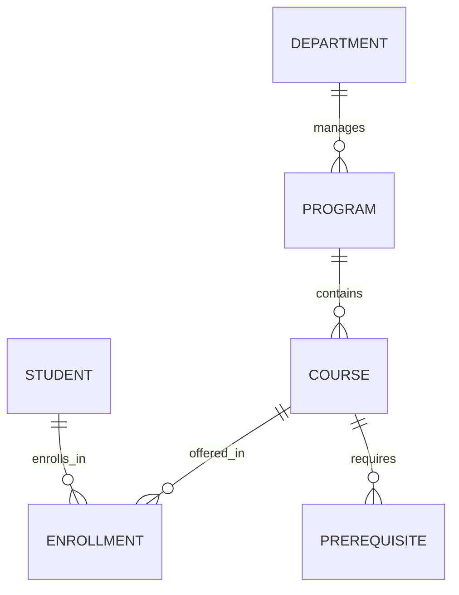
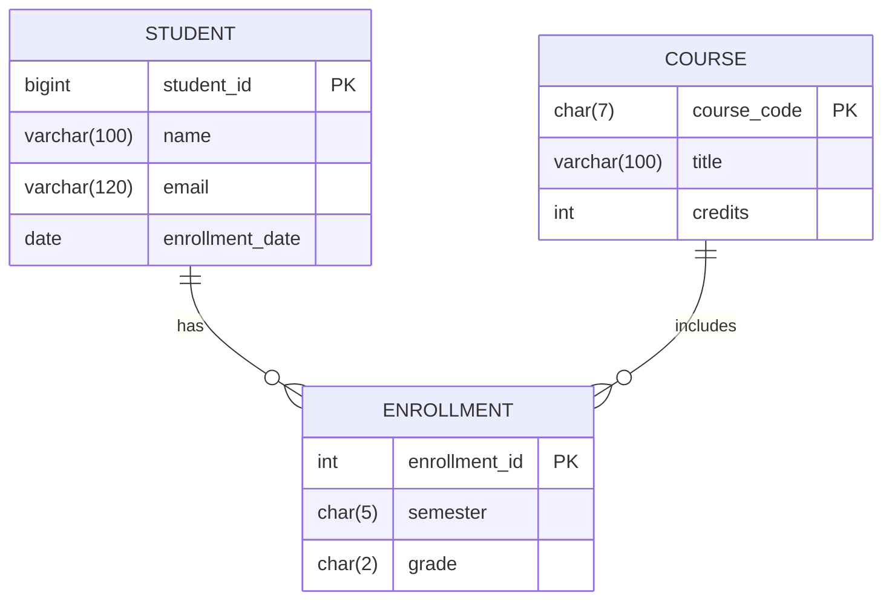

# Database-study-example

```markdown
# Database Design Study Guide (Algonquin College Example)

## 📌 Table of Contents
1. [Project Overview](#-project-overview)
2. [Database Design Roadmap](#-database-design-roadmap)
3. [Complete ER Diagram](#-complete-er-diagram)
4. [Normalization Process](#-normalization-process)
5. [SQL Schema Implementation](#-sql-schema-implementation)
6. [Optimization Techniques](#-optimization-techniques)
7. [Sample Queries](#-sample-queries)
8. [Repository Structure](#-repository-structure)

---

## 🔍 Project Overview
**Scenario:** Algonquin College Academic Management System  
**Purpose:** Design a database to track students, courses, professors, and enrollments with college-specific rules.

Key Features:
- Student enrollment tracking
- Course prerequisites management
- Semester-based grade recording
- Algonquin-specific data validation (email formats, course codes)

---

## 🗺 Database Design Roadmap

### 1. Identify Requirements
**Business Rules:**
- Students have Algonquin emails (`firstname.lastname@algonquinlive.com`)
- Course codes follow `AAA####` pattern (e.g., `CST8284`)
- Programs require minimum 60 credits for diplomas

**Entity List:**
| Entity       | Description                          |
|--------------|--------------------------------------|
| `Student`    | 9-digit student ID                  |
| `Professor`  | Faculty teaching courses            |
| `Course`     | Courses with program mapping        |
| `Enrollment` | Semester-based student registrations|
```
### 2. Entity Relationships


📊 Complete ER Diagram


🔄 Normalization Process

Before Normalization

Denormalized Table Example:

```txt
students (denormalized)
---------
id | name | courses_taken (CSV) | program_name | dean
```

Normalization Steps

1NF:

Split CSV courses → Enrollment table

Atomic values in all columns

2NF:

Move program_name to Programs table

Remove partial dependencies

3NF:

Create Departments table

Eliminate transitive dependencies (program → dean)

Normalized Schema Preview:
```sql
CREATE TABLE Programs (
    program_id INT PRIMARY KEY,
    name VARCHAR(50) NOT NULL,
    dept_id INT REFERENCES Departments(dept_id)
);
```

💻 SQL Schema Implementation
Core Tables

```sql
-- Students with email validation
CREATE TABLE Students (
    student_id BIGINT PRIMARY KEY CHECK (student_id BETWEEN 100000000 AND 999999999),
    name VARCHAR(100) NOT NULL,
    email VARCHAR(120) UNIQUE 
        CHECK (email ~* '^[a-z]+\.[a-z]+@algonquinlive\.com$'),
    program_id INT REFERENCES Programs(program_id)
);

-- Courses with code validation
CREATE TABLE Courses (
    course_code CHAR(7) PRIMARY KEY 
        CHECK (course_code ~ '^[A-Z]{3}\d{4}$'),
    title VARCHAR(100) NOT NULL,
    credits INT CHECK (credits BETWEEN 1 AND 6)
);
```

Constraints & Relationships

```sql
-- Enrollment with semester validation
CREATE TABLE Enrollments (
    enrollment_id SERIAL PRIMARY KEY,
    semester CHAR(5) NOT NULL CHECK (semester ~ '^(F|W|S)\d{4}$'),
    grade CHAR(2) CHECK (grade IN ('A+', 'A', 'B+', ..., 'F')),
    UNIQUE (student_id, course_code, semester)
);
```

⚡ Optimization Techniques

Indexing Strategy
```sql 
-- Frequently queried columns
CREATE INDEX idx_student_program ON Students(program_id);
CREATE INDEX idx_course_credits ON Courses(credits) WHERE credits > 3;
```

Partitioning Example 
```sql
-- Yearly enrollment partitioning
CREATE TABLE enrollments_2023 PARTITION OF Enrollments
    FOR VALUES FROM ('F2023') TO ('S2024');
```
Security Policies
```sql
-- Professors can only update grades for their courses
CREATE POLICY grade_update_policy ON Enrollments
FOR UPDATE TO professors
USING (EXISTS (
    SELECT 1 FROM Courses 
    WHERE Courses.course_code = Enrollments.course_code
    AND Courses.professor_id = current_user_id()
));
```
🔍 Sample Queries

1. Find Computer Science Students in Winter 2024:
```sql 
SELECT s.name, e.grade
FROM Students s
JOIN Enrollments e ON s.student_id = e.student_id
JOIN Programs p ON s.program_id = p.program_id
WHERE p.name = 'Computer Science' 
AND e.semester = 'W2024';
```

2. List Course Prerequisites:
```sql
SELECT c.title, p.prerequisite_code 
FROM Courses c
JOIN Prerequisites p ON c.course_code = p.course_code;
```

